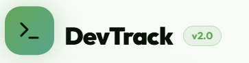
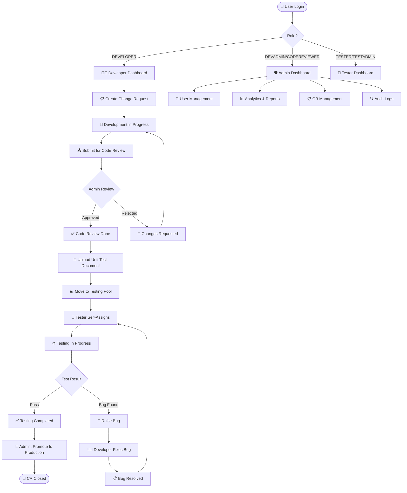
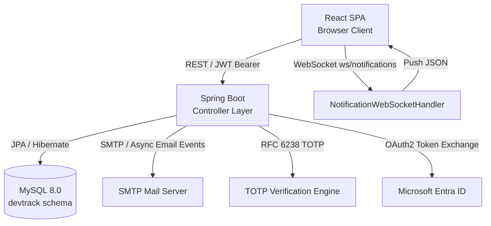
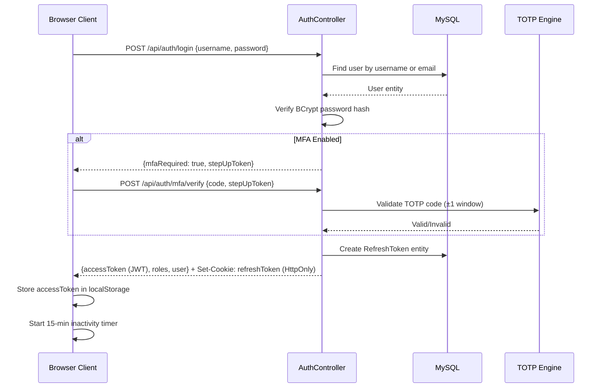

<div align="center">



# DevTrack 2.0

### Enterprise Engineering Workflow Platform

**End-to-end Change Request, Sprint, Testing, Deployment & Bug Management — built for modern software teams.**

---

[](https://openjdk.org/projects/jdk/17/)
[](https://spring.io/projects/spring-boot)
[](https://reactjs.org/)
[](https://www.typescriptlang.org/)
[](https://www.mysql.com/)
[](https://vitejs.dev/)
[](LICENSE)

[](CHANGELOG.md)
[]()
[]()
[]()
[](http://localhost:8080/swagger-ui.html)
[](https://flywaydb.org/)

</div>

---

## 📋 Table of Contents

- [About DevTrack 2.0](#-about-devtrack-20)
- [Key Features](#-key-features)
- [Application Workflow](#-application-workflow)
- [Workspaces](#-workspaces)
  - [Developer Workspace](#-developer-workspace)
  - [Tester Workspace](#-tester-workspace)
  - [Admin Workspace](#-admin-workspace)
- [Change Request Lifecycle](#-change-request-lifecycle)
- [Bug Management](#-bug-management)
- [Sprint Management](#-sprint-management)
- [Notifications](#-notifications)
- [Analytics & Reports](#-analytics--reports)
- [Technology Stack](#-technology-stack)
- [Architecture](#-architecture)
- [Folder Structure](#-folder-structure)
- [Database Schema](#-database-schema)
- [API Overview](#-api-overview)
- [Installation & Setup](#-installation--setup)
- [Configuration Reference](#-configuration-reference)
- [Role-Based Access Control](#-role-based-access-control)
- [Security](#-security)
- [Performance & Design](#-performance--design)
- [Deployment](#-deployment)
- [Features Roadmap](#-features-roadmap)
- [Contributing](#-contributing)
- [License](#-license)
- [Author](#-author)
- [Acknowledgements](#-acknowledgements)

---

## 🚀 About DevTrack 2.0

DevTrack 2.0 is a **production-grade, full-stack engineering workflow platform** that unifies the entire software delivery lifecycle — from change request creation through code review, QA testing, bug resolution, and production deployment.

Built to serve real engineering teams, DevTrack eliminates coordination friction by providing each role — Developer, Tester, and Admin — with a purpose-built, data-rich workspace, backed by enterprise-grade security, real-time notifications, and a comprehensive audit trail.

### Why DevTrack 2.0?

Most engineering teams span multiple disconnected tools: Jira for tickets, Confluence for docs, Slack for notifications, and spreadsheets for test tracking. DevTrack 2.0 collapses this sprawl into a single platform that enforces structured processes without sacrificing developer experience.

| Problem | DevTrack 2.0 Solution |
|---|---|
| No single source of truth for CR status | Centralized CR lifecycle with configurable workflow engine |
| Uncoordinated testing across teams | Atomic tester self-assignment pool prevents double-ownership |
| Bugs get lost or go untracked | Structured bug workflow tied directly to each CR |
| No visibility into developer productivity | Engineering Score formula aggregates quality & velocity |
| Security audit gaps | Tamper-proof audit log for every state transition |
| Manual deployment tracking | Deployment dates recorded per stage (SIT → UAT → Prod) |

### Business Objectives

- **Standardize CR Flow** — Enforce rigorous state transitions from draft development to production rollout
- **Traceability & Auditing** — Chronological, tamper-proof history of every state change, code review approval, and user interaction
- **Controlled Testing Lifecycles** — Prevent uncoordinated testing by assigning clear tester ownership and enforcing retesting pipelines
- **MFA Compliance** — RFC 6238 TOTP Multi-Factor Authentication via Microsoft Authenticator or any compatible app
- **Quality Risk Intelligence** — Automated engine flags CRs exceeding configurable bug/retest thresholds

### Target Users

| Role | Description |
|---|---|
| 👨‍💻 **Developer** | Creates CRs, uploads unit test artifacts, addresses code review comments, resolves bugs |
| 🧪 **Tester / QA** | Self-assigns from testing pool, executes SIT/UAT testing, logs bugs, signs off |
| 🛡️ **Admin (DEVADMIN)** | Approves code reviews, manages users, force-reassigns testers, views all audit logs |
| 🔍 **Code Reviewer** | Reviews and approves/rejects submitted CRs with comments |
| 📊 **Test Admin (TESTADMIN)** | Manages tester assignments, views all testing data, generates reports |

---

## ✨ Key Features

<details>
<summary><strong>🔐 Authentication & Security</strong></summary>

- **JWT Authentication** — HMAC-SHA256 signed access tokens with automatic rotation via refresh cookies
- **Microsoft Entra ID (Azure AD) SSO** — OAuth2 integration allowing seamless single sign-on with corporate Microsoft accounts
- **TOTP/MFA (RFC 6238)** — Offline Time-Based One-Time Password via Microsoft Authenticator or Google Authenticator
- **Trusted Device Tokens** — Skip MFA step on trusted browsers for a configurable period
- **MFA Backup Recovery Codes** — 10 cryptographically secure single-use codes generated at MFA setup
- **Brute-Force Protection** — Account lockout after configurable failed login attempts (default: 5) with timed unlock
- **Forced First-Login Password Reset** — Temporary passwords generated by admin expire within configurable TTL
- **Password Strength Enforcement** — Requires uppercase, lowercase, digit, and special character
- **Inactivity Auto-Logout** — 15-minute inactivity timeout with event-based timer reset
- **Encrypted Login Payload** — Optional hex-encoded XOR payload obfuscation for credential transport

</details>

<details>
<summary><strong>📋 Change Request Management</strong></summary>

- Full CR lifecycle from creation through production deployment
- Configurable workflow engine (`TaskWorkflowMap`) with named pipeline steps
- Branch name and Git link tracking per CR
- Multi-developer assignment with `task_developers` mapping table
- Sprint association for each CR
- Priority, effort estimation, module, and label tagging
- BRD document attachment per CR
- Timeline audit pop-up showing full state transition history
- Quality Risk Badge — automated engine flags CRs with excessive bugs or retests
- Deployment tracking per environment stage (Dev → SIT → UAT → Pre-Prod → Production)
- DevOps deployment email modal with server paths and deployment notes

</details>

<details>
<summary><strong>🧪 Testing Workflow</strong></summary>

- **Atomic Tester Assignment** — Race-safe SQL query prevents two testers from picking the same CR simultaneously
- **Tester Testing Pool** — Curated queue of CRs ready for testing, filtered by sprint and type
- **Testing Duration Tracking** — Automatic start/end timestamp capture with computed duration string
- **Retest Tracking** — Per-CR retest counter incremented on each bug cycle
- **Tested CR History** — Permanent log of all CRs tested by each tester
- **Admin Force-Reassign** — Admin can reassign tester with mandatory reason field, full audit trail
- **Testing Comments** — Rich freeform comments captured at test completion

</details>

<details>
<summary><strong>🐛 Bug Tracking</strong></summary>

- Structured bug creation with title, description, severity (Critical/High/Medium/Low), priority, steps to reproduce, expected vs actual results
- Bug attached to specific CR — updating CR status automatically on bug creation/resolution
- **Bug Review Workflow** — Developers can challenge bugs; tester can reject/confirm challenge
- **Developer Fix Summary** — Structured fix notes captured at bug resolution
- **Bug Mail Threading** — Email thread per bug tracking developer/tester communication
- File attachments on bugs (screenshots, logs)
- Bug workflow state machine: `OPEN → ASSIGNED → IN_PROGRESS → RESOLVED → CLOSED`

</details>

<details>
<summary><strong>🏃 Sprint Management</strong></summary>

- Sprint creation with name, goal, start/end dates, and status (`FUTURE/ACTIVE/COMPLETED`)
- CR-to-Sprint linking
- Sprint Tasks board with dependency tracking between tasks
- Sprint velocity calculation: sum of effort days for completed CRs per sprint
- Sprint burndown metrics visible to all roles

</details>

<details>
<summary><strong>📊 Analytics & Reporting</strong></summary>

- **Engineering Score Formula** — Quantified developer productivity accounting for efforts, bugs by severity, and retests
- **Defect Density** — Bugs per CR ratio across sprints
- **Testing Duration Analytics** — Average time testers spend per CR
- **Quality Risk Engine** — Scheduled hourly sweep flagging CRs exceeding configurable bug/retest thresholds
- **PDF Report Export** — `html2canvas` + `jsPDF` browser-native export
- **Excel/CSV Export** — Tabular data download for Developer Productivity, Testing Quality, and Audit reports

</details>

<details>
<summary><strong>🔔 Notifications</strong></summary>

- **Real-Time WebSocket Push** — Custom `NotificationWebSocketHandler` with per-user session mapping
- **HTML Email Notifications** — Thymeleaf-rendered branded email templates dispatched asynchronously
- **In-App Notification Panel** — Bell icon with unread count badge and notification history
- **Toast Notifications** — Ephemeral in-page success/error/info pop-ups with configurable duration
- **Notification Events**: CR submitted for review, code approved/rejected, bug raised, bug resolved, tester assigned, MFA reset

</details>

<details>
<summary><strong>📁 Document Management</strong></summary>

- Unit test document upload per CR (Base64 blob stored in `document_content` table)
- 25 MB upload limit with MIME-type validation
- File download via secure attachment endpoint with token validation
- Document listing per CR with metadata (name, size, uploaded by, date)
- Download prompt modal for end-user confirmation before file fetch

</details>

---

## 🔄 Application Workflow



---

## 🖥️ Workspaces

DevTrack 2.0 presents a **role-resolved workspace** — on login, each user is automatically directed to the appropriate dashboard based on their role.

### 👨‍💻 Developer Workspace

The Developer Dashboard (`/dashboard`) is the primary workspace for software engineers.

| Feature | Description |
|---|---|
| **My Active Work** | Paginated list of all CRs assigned to the current developer, filtered by status |
| **Sprint Board** | Kanban-style view of sprint tasks with drag-drop-like status updates |
| **Bug Queue** | All open bugs assigned to the developer, with severity badges and CR context |
| **Timeline** | Per-CR audit trail popup showing every status transition with timestamps and actors |
| **Smart Deadlines** | SIT, UAT, Pre-Prod, and Production target dates tracked per CR |
| **Calendar View** | Visual calendar overlay of all CR deadline milestones |
| **Code Review Submission** | One-click code review request with Git links and branch name capture |
| **Unit Test Upload** | Base64 document upload gated after code review approval |
| **DevOps Deployment Modal** | Structured form to record server paths, deployment notes, and items deployed |
| **Notifications** | Real-time bell icon with in-app notification history panel |
| **Command Palette** | `Ctrl+K` global search across CRs, bugs, and sprint tasks |
| **Dark/Light Theme** | Per-user theme preference persisted server-side |

### 🧪 Tester Workspace

The Tester Dashboard provides a focused QA environment.

| Feature | Description |
|---|---|
| **Testing Pool** | List of all CRs in `MOVE_TO_UAT` status, available for self-assignment |
| **Atomic Self-Assignment** | Race-condition-safe tester pick-up — prevents two testers claiming the same CR |
| **My Active Tests** | CRs currently assigned to the logged-in tester in `TESTING_IN_PROGRESS` |
| **Bug Raising** | Structured bug form with severity, priority, steps to reproduce, expected/actual results, and file attachments |
| **Bug Review Workflow** | Accept or challenge a bug; developer can dispute; tester makes final ruling |
| **Retest Handling** | After developer resolves a bug, CR returns to tester's queue for verification |
| **Testing Comments** | Freeform remarks captured at test pass/fail |
| **Tested CR History** | Permanent record of all CRs tested by the current tester with durations |
| **Testing Analytics** | Duration metrics, bug counts, and retest rates per tester |

### 🛡️ Admin Workspace

The Admin Dashboard (`DEVADMIN` / `TESTADMIN` roles) provides full platform control.

| Feature | Description |
|---|---|
| **User Management** | Create users with cryptographically secure temp passwords, assign roles, block/deactivate accounts |
| **Sprint Management** | Create and manage sprints, set goals and date ranges |
| **CR Management** | View all CRs across all developers, force-update statuses, reassign testers |
| **Code Review Center** | Approve or reject submitted code reviews with line-level comments |
| **Approval Center** | Centralized dashboard for all pending approvals |
| **Developer Scoreboard** | Engineering score leaderboard across the team |
| **Audit Logs** | Filterable, grouped audit log viewer with entity type, actor, old/new values |
| **Reports** | Generate Developer Productivity, Testing Quality, and Audit reports; export as PDF or Excel |
| **Analytics Dashboard** | Sprint velocity, defect density, and testing duration charts via Recharts |
| **Notifications Panel** | View and manage system-wide notifications |
| **Settings / Config** | Toggle Microsoft SSO, manage MFA policies, configure quality risk thresholds |

---

## 📋 Change Request Lifecycle

A Change Request (CR) — internally mapped to the `tasks` table — follows a strict state machine enforced at the backend via the `TaskWorkflowMap` entity.

```
DRAFT_DEVELOPMENT
    └─► CODE_REVIEW              (Developer submits for review)
            ├─► CODE_REVIEW_DONE    (Admin approves)
            │       └─► MOVE_TO_UAT    (Developer uploads unit test doc)
            │               └─► TESTING_IN_PROGRESS  (Tester self-assigns)
            │                       ├─► TESTING_COMPLETED  (Tester passes)
            │                       │       └─► CLOSED  (Admin promotes to Prod)
            │                       └─► BUG_FOUND  (Tester raises bug)
            │                               └─► (back to TESTING_IN_PROGRESS after fix)
            └─► CHANGES_REQUESTED   (Admin rejects with comments)
                    └─► (back to DRAFT_DEVELOPMENT)
```

Each transition is:
- Validated against the workflow map for the task type
- Recorded in `task_workflow_history`
- Written to `audit_logs` with actor, timestamp, old value, and new value
- Triggers real-time WebSocket notification to relevant parties

---

## 🐛 Bug Management

Bugs are entities tied to a specific CR (`bugs.bug_task_id → tasks.id`).

| State | Actor | Description |
|---|---|---|
| `OPEN` | Tester | Bug raised during testing; CR status moves to `BUG_FOUND` |
| `ASSIGNED` | System | Automatically assigned to the CR's assigned developer |
| `IN_PROGRESS` | Developer | Developer acknowledges and starts fix |
| `RESOLVED` | Developer | Fix complete; developer captures fix summary comments |
| `CLOSED` | Tester | Tester verifies fix in retest; closes bug |
| `CHALLENGED` | Developer | Developer disputes the bug's validity |
| `CHALLENGE_REJECTED` | Tester | Tester overrules the challenge; bug remains active |

**Bug Review Workflow** (via `bug_reviews` table):
1. Developer challenges a bug with reason
2. Tester receives notification and reviews the challenge
3. Tester accepts (bug closes) or rejects (bug stays `OPEN`, CR stays `BUG_FOUND`)

**Quality Risk Flagging** — The `QualityRiskService` evaluates each CR on every bug/retest event and on an hourly scheduled sweep. CRs exceeding configurable thresholds are flagged with a visual `Quality Risk Badge`.

---

## 🏃 Sprint Management

Sprints (`sprints` table) provide time-boxed containers for organizing CRs and tasks.

- **Sprint Status**: `FUTURE → ACTIVE → COMPLETED`
- **Sprint Tasks** (`sprint_tasks` table): Independent work items within a sprint, separate from CRs, with dependency tracking via `sprint_task_dependencies`
- **CR-Sprint Link**: CRs linked to a sprint via `tasks.sprint_id`
- **Velocity Metric**: Sum of effort-days for CRs reaching `CLOSED` or `TESTING_COMPLETED` within the sprint window
- **Sprint Board**: Visual task board available to all roles (`DEVELOPER`, `TESTER`, `DEVADMIN`, `TESTADMIN`, `CODEREVIEWER`)

---

## 🔔 Notifications

DevTrack 2.0 uses a **dual-channel notification system** ensuring messages are delivered even if one channel is unavailable.

### Channel 1: Real-Time WebSocket

- **Endpoint**: `ws://host/ws/notifications`
- **Implementation**: Spring `NotificationWebSocketHandler` maintains a per-user `ConcurrentHashMap` of active sessions
- **Protocol**: JSON payloads pushed server-to-client on business events
- **Payload**:
```json
{
  "type": "NOTIFICATION",
  "notification": {
    "id": 45,
    "title": "Bug Raised",
    "message": "Alice Tester raised Bug DT-101-B1 on your task Setup Login Screen.",
    "type": "BUG_RAISED",
    "timestamp": "2026-07-01T12:00:00"
  }
}
```

### Channel 2: SMTP HTML Email

- **Rendering Engine**: Thymeleaf templates producing branded HTML emails
- **Dispatch**: Asynchronous (`@Async`) via Spring Event system — does not block API response threads
- **Failure Handling**: SMTP errors are caught, logged, and recorded in audit; WebSocket channel remains unaffected

| Event | Recipients | Channels |
|---|---|---|
| CR Submitted for Review | Admins | Email + In-App |
| Code Review Approved | Assigned Developer | In-App |
| Code Review Rejected | Assigned Developer | In-App |
| Bug Raised | Developer, Tester, Admins | Email + In-App |
| Bug Resolved | Assigned Tester | In-App |
| Tester Assigned | Developer & Admins | In-App |
| Quality Risk Flag | Developer, Tester, Admins | In-App |
| User Account Created | New User | Email (Welcome + Temp Password) |
| MFA Reset | Target User | Email (Recovery Codes) |
| Password Reset Request | Requesting User | Email (Reset Link) |

---

## 📊 Analytics & Reports

### Engineering Score Formula

The platform computes a quantified productivity score per developer:

```
ES = (Efforts × 10) - (Bugs_Low × 1) - (Bugs_Medium × 2) - (Bugs_High × 5) - (Bugs_Critical × 10) - (Retests × 3)
```

A developer delivering high-effort CRs with zero bug leakage receives a strong positive score. Bug-heavy or heavily-retested CRs penalize the score proportionally.

### Available Reports

| Report | Description | Filters |
|---|---|---|
| **Developer Productivity** | Tasks assigned/closed, open bugs, avg bug resolution time | Sprint, Date Range |
| **Testing & Quality Metrics** | Defect density, testing duration, retest counts | Sprint, Tester |
| **Audit & Security Report** | Authentication activity, admin actions, IP/browser data | Date Range, User |

### Export Formats

- **PDF** — `html2canvas` renders the DOM table → `jsPDF` bundles into a multi-page PDF
- **Excel/CSV** — Tabular raw data download via JavaScript file writers

### Quality Risk Engine

- Runs **hourly** via `@Scheduled(cron = "0 0 * * * *")` sweep on all active CRs
- Also triggered on every bug creation, resolution, or retest event
- Configurable thresholds stored in the `app_config` table:
  - `quality_risk.threshold.bugs` (default: 3)
  - `quality_risk.threshold.retests` (default: 2)
  - `quality_risk.threshold.rejected_bugs` (default: 2)
  - `quality_risk.threshold.challenge_rate` (default: 30%)

---

## 🛠️ Technology Stack

### Frontend

| Technology | Version | Purpose |
|---|---|---|
| **React** | 19.x | UI component framework |
| **TypeScript** | ~6.0 | Static type safety |
| **Vite** | 8.x | Build tool & dev server |
| **Tailwind CSS** | 4.x | Utility-first styling |
| **Zustand** | 5.x | Global state management |
| **Axios** | 1.18+ | HTTP client for API calls |
| **React Router DOM** | 7.x | Client-side routing |
| **Framer Motion** | 12.x | Animations & transitions |
| **Recharts** | 3.x | Analytics charts & graphs |
| **Radix UI** | Various | Accessible headless UI primitives |
| **Lucide React** | 1.21+ | Icon library |
| **jsPDF** | 4.x | PDF export generation |
| **html2canvas** | 1.x | DOM-to-canvas for PDF |
| **qrcode.react** | 4.x | QR code rendering for MFA setup |
| **clsx / tailwind-merge** | Latest | Conditional class merging |

### Backend

| Technology | Version | Purpose |
|---|---|---|
| **Java** | 17 | Platform language |
| **Spring Boot** | 3.3.4 | Application framework |
| **Spring Security** | 6.x | Authentication & authorization |
| **Spring Data JPA** | 3.x | ORM & repository layer |
| **Spring WebSocket** | 6.x | Real-time notification push |
| **Spring Mail** | 3.x | Async email dispatch |
| **Thymeleaf** | 3.x | HTML email template engine |
| **Spring OAuth2 Client** | 3.x | Microsoft Entra ID SSO |
| **JJWT** | 0.12.6 | JWT generation & validation |
| **Flyway** | 9.x | Versioned database migrations |
| **Apache POI** | 5.2.5 | Excel report generation |
| **ShedLock** | 5.13.0 | Distributed scheduled task locking |
| **springdoc-openapi** | 2.6.0 | OpenAPI 3 / Swagger UI |
| **Lombok** | Latest | Boilerplate reduction |
| **HikariCP** | Built-in | High-performance connection pooling |

### Database & Infrastructure

| Technology | Purpose |
|---|---|
| **MySQL 8.0** | Primary relational data store |
| **Flyway Migrations** | Schema version control |
| **HikariCP** | Connection pooling (pool size: 10) |

---

## 🏛️ Architecture

### High-Level Architecture



### Backend Layered Architecture

```
┌─────────────────────────────────────────────────────────────────┐
│                     Spring Boot Application                      │
│                                                                  │
│  ┌──────────────────┐  ┌──────────────────┐  ┌───────────────┐  │
│  │  Security Layer  │  │  REST Controllers │  │  Config Layer │  │
│  │  JwtAuthFilter   │─►│  TaskController   │  │  WebSecurity  │  │
│  │  RateLimit Filter│  │  AuthController   │  │  AsyncConfig  │  │
│  │  AuthEntryPoint  │  │  BugController    │  │  OpenApiConfig│  │
│  └──────────────────┘  └────────┬─────────┘  └───────────────┘  │
│                                 │                                 │
│                    ┌────────────▼──────────────┐                 │
│                    │       Service Layer        │                 │
│                    │  BugValidationService      │                 │
│                    │  WorkflowExecutionService  │                 │
│                    │  QualityRiskService        │                 │
│                    │  EmailNotificationService  │                 │
│                    │  AsyncReportService        │                 │
│                    │  TotpService               │                 │
│                    └────────────┬──────────────┘                 │
│                                 │                                 │
│                    ┌────────────▼──────────────┐                 │
│                    │    Repository Layer (JPA)  │                 │
│                    │  TaskRepository            │                 │
│                    │  UserRepository            │                 │
│                    │  BugRepository             │                 │
│                    │  AuditLogRepository        │                 │
│                    └────────────┬──────────────┘                 │
└─────────────────────────────────┼───────────────────────────────┘
                                  │
                        ┌─────────▼─────────┐
                        │   MySQL Database   │
                        │   (Flyway managed) │
                        └───────────────────┘
```

### Frontend Architecture

```
frontend/src/
├── App.tsx                 # Root router with lazy-loaded pages & role resolution
├── pages/                  # Full-page views (Developer, Tester, Admin dashboards)
├── components/
│   ├── shared/             # Cross-cutting modals & panels (CRDetailSlideOver,
│   │                       #   BugDetailModal, NotificationPanel, MfaWizard...)
│   └── ui/                 # Base design system primitives
├── layouts/
│   └── DashboardLayout.tsx # Sidebar + Navbar shell for all authenticated views
├── store/                  # Zustand stores
│   ├── authStore.ts        # JWT session, role, inactivity tracking
│   ├── taskStore.ts        # CR/task state & API calls
│   ├── notificationStore.ts# WebSocket-driven notification state
│   ├── sprintStore.ts      # Sprint data
│   └── themeStore.ts       # Dark/light theme preference
├── services/
│   ├── auth.service.ts     # Auth API calls
│   └── document.service.ts # Document upload/download API
└── hooks/                  # Custom React hooks
```

### Authentication Flow



---

## 📁 Folder Structure

```
DevTracker 2.0/
├── frontend/                          # React + TypeScript SPA
│   ├── public/
│   │   ├── logo.png                   # Application logo
│   │   └── favicon.svg
│   ├── src/
│   │   ├── App.tsx                    # Root router & role resolution
│   │   ├── main.tsx                   # React entry point
│   │   ├── index.css                  # Global styles & Tailwind tokens
│   │   ├── pages/                     # Full-page views
│   │   │   ├── login.tsx              # Login + MFA flow
│   │   │   ├── developerDashboard.tsx # Developer workspace
│   │   │   ├── testerDashboard.tsx    # Tester workspace
│   │   │   ├── adminDashboard.tsx     # Admin overview
│   │   │   ├── crManagement.tsx       # CR list & management
│   │   │   ├── sprints.tsx            # Sprint management board
│   │   │   ├── sprintTasks.tsx        # Sprint task board
│   │   │   ├── reports.tsx            # Reports & export
│   │   │   ├── audits.tsx             # Audit log viewer
│   │   │   ├── users.tsx              # User management
│   │   │   ├── settings.tsx           # App settings & config
│   │   │   ├── deployments.tsx        # Deployment tracking
│   │   │   ├── codeReview.tsx         # Code review queue
│   │   │   ├── testedCrs.tsx          # Tested CR history
│   │   │   ├── approvalCenter.tsx     # Approval workflow center
│   │   │   ├── developers.tsx         # Developer scoreboard
│   │   │   ├── resetPassword.tsx      # Password reset via email link
│   │   │   └── setNewPassword.tsx     # Forced first-login password change
│   │   ├── components/
│   │   │   ├── shared/                # Shared modals & panels
│   │   │   │   ├── CRDetailSlideOver.tsx     # Full CR detail panel
│   │   │   │   ├── BugDetailModal.tsx        # Bug detail & workflow
│   │   │   │   ├── CreateCRModal.tsx         # CR creation wizard
│   │   │   │   ├── RaiseBugModal.tsx         # Bug submission form
│   │   │   │   ├── MfaWizard.tsx             # MFA setup wizard + QR
│   │   │   │   ├── NotificationPanel.tsx     # Sliding notification drawer
│   │   │   │   ├── NotificationPopupToast.tsx# Real-time toast popups
│   │   │   │   ├── CommandPalette.tsx        # Ctrl+K global search
│   │   │   │   ├── CRTimelinePopup.tsx       # CR audit history timeline
│   │   │   │   ├── DevOpsDeploymentModal.tsx # DevOps deploy details form
│   │   │   │   ├── DocumentUpload.tsx        # File upload with preview
│   │   │   │   ├── DocumentList.tsx          # Attached files list
│   │   │   │   ├── QualityRiskBadge.tsx      # Risk status indicator
│   │   │   │   ├── OtpVerificationModal.tsx  # TOTP code input modal
│   │   │   │   ├── MfaDeactivateModal.tsx    # MFA deactivation confirmation
│   │   │   │   ├── DownloadPromptModal.tsx   # File download confirmation
│   │   │   │   ├── DataTable.tsx             # Generic sortable table
│   │   │   │   ├── Timeline.tsx              # Timeline event list
│   │   │   │   ├── SkeletonLoader.tsx        # Loading placeholders
│   │   │   │   ├── EmptyState.tsx            # Empty content fallback
│   │   │   │   ├── ToastContainer.tsx        # Toast notification host
│   │   │   │   ├── navbar.tsx                # Top navigation bar
│   │   │   │   └── sidebar.tsx               # Role-aware left sidebar
│   │   │   └── ui/                           # Base UI primitives
│   │   ├── layouts/
│   │   │   └── DashboardLayout.tsx           # Auth shell with sidebar + navbar
│   │   ├── store/
│   │   │   ├── authStore.ts                  # Auth state (Zustand)
│   │   │   ├── taskStore.ts                  # CR & task state + API
│   │   │   ├── notificationStore.ts          # WebSocket notification state
│   │   │   ├── sprintStore.ts                # Sprint state
│   │   │   └── themeStore.ts                 # Theme preference
│   │   └── services/
│   │       ├── auth.service.ts               # Auth REST client
│   │       └── document.service.ts           # Document REST client
│   ├── package.json
│   └── vite.config.ts
│
├── backend/                           # Spring Boot 3 Java application
│   ├── pom.xml                        # Maven dependencies
│   └── src/main/
│       ├── java/com/devtrack/api/
│       │   ├── DevtrackApplication.java       # Spring Boot entry point
│       │   ├── controller/                    # REST API controllers (25 files)
│       │   │   ├── AuthController.java        # Login, MFA, password reset
│       │   │   ├── TaskController.java        # CR CRUD & workflow
│       │   │   ├── BugController.java         # Bug lifecycle management
│       │   │   ├── SprintController.java      # Sprint management
│       │   │   ├── UserController.java        # User administration
│       │   │   ├── ReportController.java      # Report generation
│       │   │   ├── NotificationController.java# Notification REST
│       │   │   ├── AnalyticsController.java   # Analytics data API
│       │   │   ├── AuditLogController.java    # Audit log API
│       │   │   ├── QualityRiskController.java # Quality risk badge API
│       │   │   └── ...
│       │   ├── model/                         # JPA entity classes (36 files)
│       │   │   ├── User.java                  # User with MFA fields
│       │   │   ├── Task.java                  # CR/Task entity
│       │   │   ├── Bug.java                   # Bug entity
│       │   │   ├── Sprint.java                # Sprint entity
│       │   │   ├── AuditLog.java              # Audit trail entry
│       │   │   ├── Workflow.java              # Workflow definition
│       │   │   ├── TaskWorkflowMap.java       # CR state transitions
│       │   │   ├── BugWorkflowMap.java        # Bug state transitions
│       │   │   └── ...
│       │   ├── services/                      # Business logic layer (16 files)
│       │   │   ├── WorkflowExecutionService.java  # State machine executor
│       │   │   ├── BugValidationService.java      # Bug review rules
│       │   │   ├── QualityRiskService.java         # Scheduled risk engine
│       │   │   ├── EmailNotificationService.java   # SMTP + Thymeleaf dispatch
│       │   │   ├── AsyncReportService.java         # Background report jobs
│       │   │   ├── TotpService.java                # RFC 6238 TOTP engine
│       │   │   ├── DocumentService.java            # File upload/storage
│       │   │   └── ...
│       │   ├── security/                      # Spring Security components
│       │   │   ├── WebSecurityConfig.java     # CORS, filter chain, OAuth2
│       │   │   ├── JwtUtils.java              # JWT generation & validation
│       │   │   ├── AuthTokenFilter.java       # Per-request JWT filter
│       │   │   └── RateLimitingFilter.java    # Request rate limiting
│       │   ├── config/                        # Spring configuration beans
│       │   │   ├── OpenApiConfig.java         # Swagger / OpenAPI 3 config
│       │   │   ├── NotificationWebSocketHandler.java # WS session manager
│       │   │   ├── AsyncConfig.java           # Thread pool for @Async
│       │   │   └── PersistanceDevtrackConfiguration.java # HikariCP setup
│       │   ├── repository/                    # Spring Data JPA repositories
│       │   ├── dto/                           # Request/Response DTOs
│       │   ├── event/                         # Spring application events
│       │   └── notification/                  # Notification model/service
│       └── resources/
│           ├── application.properties         # Environment configuration
│           ├── templates/                     # Thymeleaf email templates
│           │   ├── welcome.html
│           │   ├── password-reset.html
│           │   ├── bug-notification.html
│           │   ├── bug-update.html
│           │   ├── codereview-request.html
│           │   ├── codereview-approval.html
│           │   ├── uat-testing.html
│           │   └── uat-testing-complete.html
│           └── db/migration/                  # Flyway SQL migration scripts
│
├── docs/                              # Technical documentation suite
│   ├── DevTrack_Master_Documentation.md  # 75KB master doc
│   ├── 01_executive_summary.md
│   ├── 04_system_architecture.md
│   ├── 07_database.md
│   ├── 08_api.md
│   ├── 09_workflows.md
│   ├── 12_rbac.md
│   ├── 13_security.md
│   ├── 14_notifications.md
│   ├── 17_reports.md
│   ├── 18_analytics.md
│   └── 30_roadmap.md
│
├── db_schema_recreate.sql             # Complete DB schema (38 KB)
└── README.md                          # This file
```

---

## 🗃️ Database Schema

The schema is managed by **Flyway** — all migrations live in `src/main/resources/db/migration/`.

| Table | Purpose |
|---|---|
| `users` | Authenticated accounts with BCrypt password, MFA secret, role collection |
| `user_roles` | Many-to-many mapping: user ↔ `Role` enum (DEVADMIN, DEVELOPER, TESTER, TESTADMIN, CODEREVIEWER) |
| `tasks` | Change Requests — the core entity tracking the full CR lifecycle |
| `task_developers` | Multi-developer assignment per CR |
| `task_workflow_history` | Immutable log of every CR state transition |
| `task_workflow_map` | Defines valid state transitions per task type |
| `bugs` | Defects raised against specific CRs |
| `bug_reviews` | Developer challenge / tester ruling on disputed bugs |
| `bug_developer_fix_summary` | Structured fix notes submitted by developer on bug resolution |
| `bug_mail_thread` | Email thread tracking per bug |
| `sprints` | Time-boxed sprint containers |
| `sprint_tasks` | Independent sprint-level tasks |
| `sprint_task_dependencies` | Task-to-task dependency graph within a sprint |
| `cr_sprint_task_link` | Many-to-many CR ↔ SprintTask linkage |
| `audit_logs` | Tamper-proof history: entity type, old value, new value, actor, timestamp |
| `audit_groups` | Grouped audit records by session or operation |
| `notifications` | Persistent in-app notification records per user |
| `documents` | File metadata (name, size, type, owner) |
| `document_content` | Base64 binary blob storage for uploaded files |
| `attachments` | Bug/task attachments metadata |
| `refresh_tokens` | Rotating JWT refresh tokens mapped to users |
| `password_reset_tokens` | Time-limited tokens for email-based password reset |
| `mfa_backup_codes` | Single-use TOTP recovery codes |
| `mfa_trusted_devices` | Trusted device tokens (hashed, with expiry) |
| `workflows` | Named workflow templates |
| `workflow_steps` | Ordered steps within a workflow |
| `bug_workflow_map` | Valid bug state transitions |
| `quality_risk_history` | Snapshots of quality risk evaluations per CR |
| `report_jobs` | Asynchronous report generation job tracking |
| `app_config` | Key-value configuration store (MS SSO toggle, risk thresholds) |
| `shedlock` | Distributed lock table for scheduled tasks (ShedLock) |

---

## 🌐 API Overview

The backend exposes a fully documented **OpenAPI 3.0** REST API, accessible via Swagger UI at:

```
http://localhost:8080/swagger-ui.html
```

### API Groups

<details>
<summary><strong>🔐 Authentication — /api/auth</strong></summary>

| Method | Endpoint | Description |
|---|---|---|
| `POST` | `/api/auth/login` | Username/password login with MFA check |
| `POST` | `/api/auth/microsoft/login` | Microsoft Entra ID SSO login |
| `GET` | `/api/auth/microsoft/config` | Get MS SSO policy status |
| `POST` | `/api/auth/refreshtoken` | Rotate JWT via refresh cookie |
| `POST` | `/api/auth/logout` | Revoke tokens & clear cookie |
| `GET` | `/api/auth/me` | Get current user from token |
| `POST` | `/api/auth/set-new-password` | Force first-login password change |
| `POST` | `/api/auth/forgot-password` | Request password reset email |
| `POST` | `/api/auth/reset-password` | Reset password via token |
| `POST` | `/api/auth/admin/create-user` | Admin provisions new user |

</details>

<details>
<summary><strong>📋 Change Requests — /api/tasks</strong></summary>

| Method | Endpoint | Description |
|---|---|---|
| `GET` | `/api/tasks` | List all CRs (filtered by role) |
| `POST` | `/api/tasks` | Create new CR |
| `GET` | `/api/tasks/{id}` | Get CR by ID |
| `PUT` | `/api/tasks/{id}` | Update CR |
| `POST` | `/api/tasks/{id}/assign-tester` | Atomic tester self-assignment |
| `POST` | `/api/tasks/{id}/reassign-tester` | Admin force-reassign tester |
| `GET` | `/api/tasks/{id}/timeline` | CR audit timeline events |
| `GET` | `/api/tasks/pool` | Get testing pool CRs |

</details>

<details>
<summary><strong>🐛 Bugs — /api/bugs</strong></summary>

| Method | Endpoint | Description |
|---|---|---|
| `GET` | `/api/bugs` | List bugs (filtered by role) |
| `POST` | `/api/bugs` | Create bug on a CR |
| `GET` | `/api/bugs/{id}` | Get bug by ID |
| `PUT` | `/api/bugs/{id}` | Update bug status/details |
| `POST` | `/api/bugs/{id}/resolve` | Developer resolves bug |
| `POST` | `/api/bugs/{id}/close` | Tester closes verified bug |
| `POST` | `/api/bugs/{id}/challenge` | Developer challenges bug |

</details>

<details>
<summary><strong>🏃 Sprints — /api/sprints</strong></summary>

| Method | Endpoint | Description |
|---|---|---|
| `GET` | `/api/sprints` | List all sprints |
| `POST` | `/api/sprints` | Create sprint |
| `PUT` | `/api/sprints/{id}` | Update sprint |
| `GET` | `/api/sprint-tasks` | List sprint tasks |
| `POST` | `/api/sprint-tasks` | Create sprint task |

</details>

<details>
<summary><strong>👥 Users — /api/users</strong></summary>

| Method | Endpoint | Description |
|---|---|---|
| `GET` | `/api/users` | List all users |
| `PUT` | `/api/users/{id}` | Update user profile/role |
| `PUT` | `/api/users/{id}/status` | Block/deactivate/activate user |

</details>

<details>
<summary><strong>📊 Reports & Analytics — /api/reports, /api/analytics</strong></summary>

| Method | Endpoint | Description |
|---|---|---|
| `GET` | `/api/reports` | List available reports |
| `POST` | `/api/report-jobs` | Trigger async report generation |
| `GET` | `/api/analytics/dashboard` | Aggregate analytics metrics |

</details>

<details>
<summary><strong>🔐 MFA — /api/mfa</strong></summary>

| Method | Endpoint | Description |
|---|---|---|
| `POST` | `/api/mfa/setup` | Generate TOTP secret + QR URI |
| `POST` | `/api/mfa/verify` | Verify TOTP code & activate MFA |
| `POST` | `/api/mfa/deactivate` | Deactivate MFA (with TOTP confirmation) |
| `POST` | `/api/mfa/verify-step-up` | Step-up verification during login |
| `POST` | `/api/mfa/trusted-device` | Register trusted device token |

</details>

---

## 🚀 Installation & Setup

### Prerequisites

| Requirement | Version |
|---|---|
| Java JDK | 17+ |
| Maven | 3.8+ |
| Node.js | 18+ |
| MySQL | 8.0+ |
| npm | 9+ |

### 1. Clone the Repository

```bash
git clone https://github.com/vaibhavtomar04/DevTracker.git
cd "DevTracker 2.0"
```

### 2. Database Setup

```sql
-- Connect to MySQL as root
CREATE DATABASE devtrack CHARACTER SET utf8mb4 COLLATE utf8mb4_unicode_ci;
CREATE USER 'devtrack'@'localhost' IDENTIFIED BY 'devtrack';
GRANT ALL PRIVILEGES ON devtrack.* TO 'devtrack'@'localhost';
FLUSH PRIVILEGES;
```

> **Note:** Flyway will automatically run all migration scripts on first startup. No manual schema import required.
>
> If you prefer to import the full schema directly:
> ```bash
> mysql -u devtrack -p devtrack < db_schema_recreate.sql
> ```

### 3. Backend Configuration

Create a `.env` file or set environment variables:

```env
DB_HOST=localhost
DB_PORT=3306
DB_NAME=devtrack
DB_USER=devtrack
DB_PASSWORD=devtrack

DEVTRACK_JWT_SECRET=your-super-secret-jwt-key-minimum-32-chars

ALLOWED_ORIGINS=http://localhost:5173

# Email (optional — configure your SMTP provider)
SEND_NOTIFICATION_URL=https://your-smtp-service/sendEmail
TESTING_MAIL_SENDER=noreply@yourcompany.com

# Microsoft Entra ID SSO (optional)
# Configure client_id and tenant_id in app_config table
```

### 4. Build & Run the Backend

```bash
cd backend

# Run in development mode
mvn spring-boot:run

# Or build the jar
mvn clean package -DskipTests
java -jar target/devtrack-backend-1.0.0.jar
```

The backend starts on **http://localhost:8080**

Swagger UI: **http://localhost:8080/swagger-ui.html**

### 5. Install & Run the Frontend

```bash
cd frontend

npm install

# Development server (proxies /api to localhost:8080)
npm run dev
```

The frontend starts on **http://localhost:5173**

### 6. First Login

> **Seed Data** — A default admin user must be created directly in the database if no seed is provided:

```sql
-- Insert a DEVADMIN user (password: Admin@1234)
-- BCrypt hash of Admin@1234 with work factor 10:
INSERT INTO users (username, password, full_name, email, status, must_change_password, mfa_enabled, failed_login_attempts, account_locked)
VALUES ('admin', '$2a$10$N.zmdr9k7uOCQb376NoUnuTJ8iAt6Z5EHsM8lE9lBpwTTyVG5hxEi', 'System Administrator', 'admin@devtrack.com', 'ACTIVE', 0, 0, 0, 0);

INSERT INTO user_roles (user_id, role) VALUES (LAST_INSERT_ID(), 'DEVADMIN');
```

Login at **http://localhost:5173/login** with `admin` / `Admin@1234`

### 7. Production Build (Single JAR)

```bash
# 1. Build the frontend
cd frontend && npm run build

# 2. The Maven build copies the dist/ folder into the JAR
cd ../backend && mvn clean package -DskipTests

# 3. Run the single fat JAR
java -jar target/devtrack-backend-1.0.0.jar
```

The app is now served at **http://localhost:8080** — frontend and backend in a single process.

---

## ⚙️ Configuration Reference

All configuration lives in `backend/src/main/resources/application.properties` with environment variable override support.

| Property | Default | Description |
|---|---|---|
| `server.port` | `8080` | Backend HTTP port |
| `DB_HOST` | `localhost` | MySQL hostname |
| `DB_PORT` | `3306` | MySQL port |
| `DB_NAME` | `devtrack` | Database name |
| `DB_USER` | `devtrack` | DB username |
| `DB_PASSWORD` | `devtrack` | DB password |
| `DEVTRACK_JWT_SECRET` | (dev key) | HMAC-SHA256 JWT signing secret (change in prod!) |
| `devtrack.jwtExpirationMs` | `86400000` | JWT access token TTL (24h) |
| `ALLOWED_ORIGINS` | `http://localhost:5173` | CORS allowed origins |
| `MAX_FAILED_ATTEMPTS` | `5` | Login attempts before account lock |
| `LOCK_DURATION_MINS` | `15` | Account lock duration in minutes |
| `TEMP_PASS_TTL_HOURS` | `24` | Admin-generated temp password expiry |
| `BACKEND_BASE_URL` | `http://localhost:8080` | Used in email links |
| `spring.servlet.multipart.max-file-size` | `25MB` | Max upload size |
| `document.max-size-bytes` | `26214400` | Max document size in bytes (25MB) |
| `springdoc.swagger-ui.path` | `/swagger-ui.html` | Swagger UI path |

### Database Connection Pool (HikariCP)

| Property | Default | Description |
|---|---|---|
| `maximumPoolSize` | `10` | Maximum active DB connections |
| `minimumIdle` | `2` | Minimum idle connections |
| `idleTimeout` | `30000ms` | Time before idle connection is closed |
| `maxLifetime` | `1800000ms` | Max connection lifetime (30 min) |

---

## 🔐 Role-Based Access Control

DevTrack 2.0 implements **dual-layer RBAC** — enforced at both the Spring Security layer (`@PreAuthorize`) and the React frontend (conditional rendering based on `useAuthStore`).

### Roles

| Role | Description |
|---|---|
| `DEVADMIN` | Full administrative access — user management, code review approval, all reports |
| `DEVELOPER` | Create & manage their assigned CRs, resolve bugs, upload unit test docs |
| `TESTER` | Self-assign CRs from testing pool, raise bugs, close verified bugs |
| `TESTADMIN` | All Tester permissions + reassign testers + access to test reports |
| `CODEREVIEWER` | Code review approval (subset of DEVADMIN capabilities) |

### Permissions Matrix

| Action | DEVADMIN | DEVELOPER | TESTER | TESTADMIN | CODEREVIEWER |
|---|:---:|:---:|:---:|:---:|:---:|
| Create CR | ✅ | ✅ | ❌ | ❌ | ❌ |
| Update CR (Dev states) | ❌ | ✅ (own) | ❌ | ❌ | ❌ |
| Approve Code Review | ✅ | ❌ | ❌ | ❌ | ✅ |
| Upload Unit Test Doc | ❌ | ✅ | ❌ | ❌ | ❌ |
| Move to Testing Pool | ❌ | ✅ (own) | ❌ | ❌ | ❌ |
| Self-Assign Tester | ❌ | ❌ | ✅ | ✅ | ❌ |
| Force-Reassign Tester | ✅ | ❌ | ❌ | ✅ | ❌ |
| Raise Bug | ❌ | ❌ | ✅ | ✅ | ❌ |
| Resolve Bug | ❌ | ✅ (own) | ❌ | ❌ | ❌ |
| Close Bug | ❌ | ❌ | ✅ | ✅ | ❌ |
| Manage Users | ✅ | ❌ | ❌ | ❌ | ❌ |
| View Audit Logs | ✅ | ✅ | ✅ | ✅ | ✅ |
| View Reports | ✅ | ❌ | ❌ | ✅ | ❌ |
| Manage Sprints | ✅ | ❌ | ❌ | ✅ | ❌ |
| Reset MFA | ✅ | ❌ | ❌ | ❌ | ❌ |

### Route Protection (Frontend)

```tsx
// Example: Code Review route restricted to DEVADMIN & CODEREVIEWER
<Route
  path="/dashboard/code-review"
  element={
    <ProtectedRoute allowedRoles={["DEVADMIN", "CODEREVIEWER"]}>
      <CodeReviewPage />
    </ProtectedRoute>
  }
/>
```

---

## 🛡️ Security

### Password Security
- **Algorithm**: BCrypt with work factor 10
- **Password Policy**: Minimum 8 characters; requires uppercase, lowercase, digit, and special character
- **Temporary Passwords**: Cryptographically generated via `SecureRandom`; 12 characters; expire within configurable TTL

### JWT Implementation
- **Algorithm**: HMAC-SHA256 (HS256)
- **Access Token TTL**: 24 hours (configurable)
- **Refresh Token**: HTTP-Only `SameSite=Lax` cookie; 24-hour validity; rotated on each use
- **Storage**: Access token in `localStorage`; refresh in HTTP-Only cookie
- **Revocation**: `refreshTokenService.deleteByUserId()` on logout

### TOTP / MFA
- **Standard**: RFC 6238 (TOTP) + RFC 4226 (HOTP)
- **Algorithm**: HMAC-SHA1 with 32-character Base32 secret
- **Window**: 30-second codes, ±1 step tolerance (90-second effective window)
- **Backup Codes**: 10 unique, single-use, 10-character alphanumeric codes
- **Trusted Devices**: BCrypt-hashed device tokens with configurable expiry

### Account Security
- **Brute-Force Protection**: Lock after N failed attempts (configurable, default 5)
- **Auto-Unlock**: Lock expires after configurable duration (default 15 min)
- **Status Control**: Admin can set account to `BLOCKED` or `DEACTIVATED`
- **Inactivity Timeout**: 15-minute client-side auto-logout on all user input events

### Network Security
- **CORS**: Configurable allowed origins via `ALLOWED_ORIGINS` env var
- **Rate Limiting**: `RateLimitingFilter` throttles requests per IP
- **SQL Injection**: Prevented by Hibernate parameterized queries (no raw string concatenation)
- **File Upload Security**: MIME-type validation, size limits (25 MB), directory traversal prevention
- **Payload Obfuscation**: Optional hex-XOR payload encoding for login credentials in transit

### Audit Trail
Every significant action writes an immutable entry to `audit_logs`:
- User logins/logouts
- CR status transitions
- Code review approvals/rejections
- Bug lifecycle events
- Tester assignments & reassignments
- User creation/modification
- MFA setup/deactivation
- Password changes & resets

---

## ⚡ Performance & Design

### Backend Optimizations
- **HikariCP Connection Pool** — Pool size of 10, minimum 2 idle, with leak detection
- **Batch Loading** — `@BatchSize(size = 50)` on `task.developers` collection to prevent N+1 queries
- **Asynchronous Execution** — Email dispatch and report generation run on dedicated thread pools via `@Async`
- **Distributed Task Lock** — ShedLock prevents duplicate scheduled jobs in multi-instance deployments
- **No DDL on Startup** — `ddl-auto=none`; Flyway manages schema; no surprise table recreations

### Frontend Optimizations
- **Code Splitting** — All page components lazy-loaded via `React.lazy()` + `Suspense`
- **Animated Skeleton Loaders** — `SkeletonLoader` component renders during API fetches
- **Optimistic UI** — Store updates applied before server confirmation for perceived speed
- **Theme Persistence** — User theme preference stored server-side (`users.theme`), restored on next session
- **IntersectionObserver** — Lazy rendering of off-screen list items in large CR tables

### Database
- **Read Committed Isolation** — MySQL default; sufficient for this workload profile
- **Atomic Tester Assignment** — Query-level `WHERE tester_id IS NULL` check prevents concurrent pick-up race condition
- **Indexed Foreign Keys** — All `JOIN` columns carry indexes for query performance
- **Soft Archiving** — CRs and bugs are never hard-deleted; filtered by UI state

---

## 🚢 Deployment

### Development

```bash
# Terminal 1: Backend
cd backend && mvn spring-boot:run

# Terminal 2: Frontend (dev server with HMR)
cd frontend && npm run dev
```

### Production — Single JAR (Recommended)

```bash
# 1. Build frontend production bundle
cd frontend && npm run build

# 2. Package backend with embedded frontend
cd backend && mvn clean package -DskipTests

# 3. Run
java -Xms512m -Xmx1024m \
  -DDEVTRACK_JWT_SECRET=your-production-secret \
  -DDB_HOST=your-db-host \
  -DDB_PASSWORD=your-db-password \
  -DALLOWED_ORIGINS=https://your-domain.com \
  -jar target/devtrack-backend-1.0.0.jar
```

### Production — Behind Nginx

```nginx
server {
    listen 443 ssl;
    server_name devtrack.yourcompany.com;

    ssl_certificate /path/to/cert.pem;
    ssl_certificate_key /path/to/key.pem;

    location / {
        proxy_pass http://localhost:8080;
        proxy_set_header Host $host;
        proxy_set_header X-Real-IP $remote_addr;
        proxy_set_header X-Forwarded-For $proxy_add_x_forwarded_for;
        proxy_set_header X-Forwarded-Proto $scheme;
    }

    location /ws/ {
        proxy_pass http://localhost:8080;
        proxy_http_version 1.1;
        proxy_set_header Upgrade $http_upgrade;
        proxy_set_header Connection "upgrade";
    }
}
```

### Environment Variable Summary for Production

```bash
DEVTRACK_JWT_SECRET=<minimum-32-char-secret>
DB_HOST=<mysql-host>
DB_PORT=3306
DB_NAME=devtrack
DB_USER=<db-user>
DB_PASSWORD=<db-password>
ALLOWED_ORIGINS=https://devtrack.yourcompany.com
BACKEND_BASE_URL=https://devtrack.yourcompany.com
SEND_NOTIFICATION_URL=<smtp-service-url>
```

> ⚠️ **Never** use the default `devtrack-super-secret-key-12345...` JWT secret in production.

---

## 🗺️ Features Roadmap

### ✅ Implemented (v2.0.0)

- [x] JWT Authentication with access + refresh token rotation
- [x] Microsoft Entra ID (Azure AD) SSO login
- [x] TOTP / MFA via RFC 6238 (Google/Microsoft Authenticator)
- [x] MFA backup recovery codes
- [x] Trusted device tokens (skip MFA on known browsers)
- [x] Role-Based Access Control (DEVADMIN, DEVELOPER, TESTER, TESTADMIN, CODEREVIEWER)
- [x] Complete CR lifecycle with configurable workflow engine
- [x] Atomic tester self-assignment (race-condition safe)
- [x] Structured bug tracking with severity, priority, steps, expected/actual
- [x] Bug review workflow (developer challenge / tester ruling)
- [x] Sprint management with CR linking and velocity tracking
- [x] Sprint task board with dependency tracking
- [x] Quality Risk Engine (automated CR flagging with configurable thresholds)
- [x] Real-time WebSocket in-app notifications
- [x] Async SMTP HTML email notifications (Thymeleaf templates)
- [x] Tamper-proof audit log with full history
- [x] Document upload/download (Base64 blob storage)
- [x] Report generation (Developer Productivity, Testing Quality, Audit)
- [x] PDF and Excel/CSV report export
- [x] Engineering Score analytics formula
- [x] Command Palette (Ctrl+K global search)
- [x] Dark/light theme with server-side persistence
- [x] OpenAPI 3.0 / Swagger UI
- [x] Flyway database migration management
- [x] ShedLock for distributed scheduled task safety
- [x] Brute-force login protection with auto-unlock
- [x] Inactivity auto-logout (15 minutes)
- [x] Rate-limiting filter

### 🔄 In Progress

- [ ] Advanced analytics dashboards with chart visualizations
- [ ] Code review line-level comment threading
- [ ] Sprint burndown chart visualization

### 📅 Planned

- [ ] **GitHub / GitLab Webhooks** — PR merge triggers automatic CR state transition
- [ ] **Jenkins / GitLab CI Integration** — Pipeline success auto-advances CR to `SIT_DEPLOYED`
- [ ] **Slack Notifications** — Real-time channel alerts with interactive approval buttons
- [ ] **Microsoft Teams Notifications** — Adaptive card notifications in Teams channels
- [ ] **AI Bug Analysis** — LLM-powered reproduction step parsing and test script generation
- [ ] **Velocity Estimation ML** — Sprint effort forecasting based on historical data
- [ ] **Mobile Companion App** — React Native app for iOS/Android
- [ ] **Electron Desktop Client** — System tray notifications and quick status updates
- [ ] **Git Integration** — Branch creation and PR management from within DevTrack
- [ ] **Release Management** — Version tagging and release note generation
- [ ] **Advanced Quality Risk** — ML-based risk prediction per CR type and developer history

---

## 🤝 Contributing

Contributions are welcome! Please follow the guidelines below to keep the codebase consistent and maintainable.

### Branch Naming Convention

```
feature/DT-<id>-brief-description       # New features
fix/DT-<id>-brief-description           # Bug fixes
hotfix/DT-<id>-brief-description        # Critical production fixes
refactor/DT-<id>-brief-description      # Code improvements
docs/brief-description                   # Documentation only
```

### Commit Message Format

Follow [Conventional Commits](https://www.conventionalcommits.org/):

```
feat(auth): add trusted device token support for MFA bypass
fix(bug): resolve concurrent tester assignment race condition
refactor(services): extract QualityRiskService from TaskController
docs(readme): add installation guide for Windows
test(auth): add unit tests for TOTP verification edge cases
```

### Pull Request Process

1. Fork the repository and create a branch from `main`
2. Ensure your code compiles and passes existing tests (`mvn test`)
3. For frontend changes, ensure `npm run lint` passes
4. Add or update documentation for new features
5. Update the relevant section in `docs/` if architectural changes are made
6. Create a PR with a clear description referencing the related issue (e.g. `Closes #42`)
7. Request review from at least one maintainer

### Code Standards

**Backend (Java)**
- Follow standard Java naming conventions
- All public service methods should be `@Transactional` where appropriate
- New endpoints must include `@Operation` Swagger annotations
- Sensitive operations must write to `audit_logs`
- No raw SQL — use Spring Data JPA or `@Query` with named parameters

**Frontend (TypeScript/React)**
- Use Zustand stores for any shared state — do not use React Context for global state
- All API calls should go through the store or a service file — no inline `fetch()` in components
- Use Tailwind utility classes; avoid inline styles
- New modals/panels should be added to `components/shared/`
- All interactive elements must have unique `id` attributes

### Testing Requirements

- Backend: Add JUnit tests for new service methods in `src/test/`
- Frontend: Add component tests for new shared components
- Ensure the application builds cleanly: `mvn clean package -DskipTests` must pass

---

## 📄 License

This project is proprietary software. All rights reserved.

© 2026 DevTrack Engineering. Unauthorized copying, distribution, or modification is strictly prohibited.

---

## 👤 Author

<div align="center">

**Vaibhav Tomar**

[](https://github.com/vaibhavtomar04)
[](https://linkedin.com/in/vaibhavtomar04)
[](mailto:developer@example.com)

*Senior Software Engineer | Spring Boot · React · MySQL · DevOps*

</div>

---

## 🙏 Acknowledgements

DevTrack 2.0 is built on the shoulders of exceptional open-source projects:

| Project | Role in DevTrack |
|---|---|
| [Spring Boot](https://spring.io/projects/spring-boot) | Application framework & auto-configuration |
| [Spring Security](https://spring.io/projects/spring-security) | Authentication, authorization & JWT filter chain |
| [Flyway](https://flywaydb.org/) | Database migration versioning |
| [JJWT](https://github.com/jwtk/jjwt) | JWT generation and validation |
| [React](https://react.dev/) | Frontend component framework |
| [Vite](https://vitejs.dev/) | Build tool & hot module replacement |
| [Tailwind CSS](https://tailwindcss.com/) | Utility-first styling |
| [Zustand](https://github.com/pmndrs/zustand) | Lightweight global state management |
| [Framer Motion](https://www.framer.com/motion/) | Smooth UI animations |
| [Recharts](https://recharts.org/) | Analytics charts and visualizations |
| [Radix UI](https://www.radix-ui.com/) | Accessible headless UI primitives |
| [Lucide React](https://lucide.dev/) | Icon library |
| [Apache POI](https://poi.apache.org/) | Excel report generation |
| [ShedLock](https://github.com/lukas-krecan/ShedLock) | Distributed scheduled task locking |
| [springdoc-openapi](https://springdoc.org/) | OpenAPI 3 / Swagger UI integration |
| [HikariCP](https://github.com/brettwooldridge/HikariCP) | High-performance JDBC connection pooling |
| [Lombok](https://projectlombok.org/) | Java boilerplate reduction |
| [Thymeleaf](https://www.thymeleaf.org/) | HTML email template engine |

---

<div align="center">

**DevTrack 2.0** — *Built with precision for engineering teams that demand more.*

⭐ If this project helped you, please consider starring the repository.

</div>
