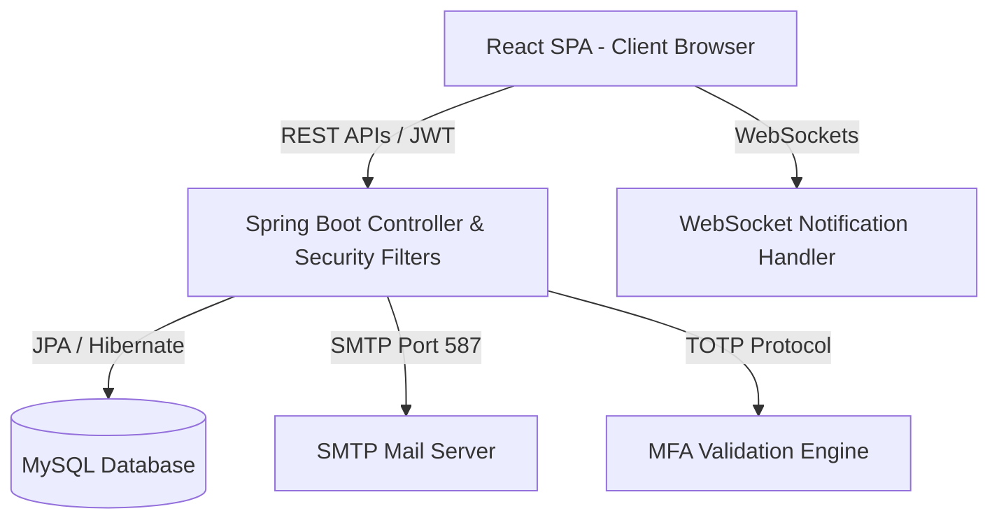

# Chapter 4: System Architecture

This document presents the architectural blueprints, design patterns, component relationships, and execution pipelines of DevTrack 2.0.

---

## 4.1 High-Level Architecture
DevTrack 2.0 is structured as a decoupled Single Page Application (SPA) communicating over REST and WebSocket connections with a stateless Spring Boot microservice container.



---

## 4.2 Low-Level Architecture & Layered Patterns
The application enforces strict separation of concerns through standard enterprise layered patterns:
1. **Presentation Layer (Frontend)**: React components rendering views using global state fetched via Axios/Fetch API from Zustand stores.
2. **Controller Layer (API Gateway)**: REST controller endpoints map routes, validate payloads using `@Valid` annotations, and return HTTP ResponseEntities.
3. **Security Layer**: Intercepts requests, validates JWT authorization headers, sets SecurityContextHolder, and enforces endpoint-level annotations (`@PreAuthorize`).
4. **Service Layer (Business Logic)**: Transactional services (`@Service`) orchestrating database reads/writes, triggering system events, sending notifications, and running workflows.
5. **Data Access Layer (Repository)**: Spring Data JPA Repositories mapping database entities to queries.
6. **Database Layer**: MySQL relational storage managed by version-controlled Flyway SQL scripts.

---

## 4.3 Logical Architecture
```
+-------------------------------------------------------------------------------------------------+
|                                     React Frontend App                                          |
|  +-----------------------+   +------------------------+   +----------------------------------+  |
|  |       UI Views        |   |     State Stores       |   |       API Clients / Axios        |  |
|  | Developer/Tester/Admin|-->|  authStore, taskStore  |-->|  Sends JWT auth headers to       |  |
|  +-----------------------+   +------------------------+   |  REST backend endpoints          |  |
|                                                           +----------------------------------+  |
+-------------------------------------------------------------------------------------------------+
                                                |
                                                v
+-------------------------------------------------------------------------------------------------+
|                                    Spring Boot Backend REST Container                           |
|  +-----------------------+   +------------------------+   +----------------------------------+  |
|  |     Security Context   |   |   Controllers (APIs)   |   |        Service Layers            |  |
|  | JWT Validation Filter |-->| Task, Auth, Bug, Admin |-->| TaskService, AuthService, Mfa    |  |
|  +-----------------------+   +------------------------+   +----------------------------------+  |
|                                                                           |                     |
|                                                                           v                     |
|                                                           +----------------------------------+  |
|                                                           |      JPA Repository layer        |  |
|                                                           | TaskRepository, UserRepository   |  |
|                                                           +----------------------------------+  |
+-------------------------------------------------------------------------------------------------+
```

---

## 4.4 Deployment Architecture
- **Development**: Local compilation. React Vite dev-server runs on port 5173 proxying API requests to Spring Boot on port 8080.
- **SIT / UAT**: Static production build of React is compiled and copied into the backend's `/src/main/resources/static/` folder. Maven builds a single fat executable jar containing both client pages and backend server. Run via standard Java virtual machine.
- **Production**: Fat Jar runs behind an Nginx reverse-proxy handling SSL termination, rate-limiting, and static file caching.

---

## 4.5 Component Architecture
- **Auth Component**: Standard username/password validation, refresh token rotation, and Google Authenticator TOTP generator/verifier.
- **Workflow Engine**: Orchestrates transitions using status definitions and maps them to TaskWorkflowMap.
- **Attachment Component**: Encodes documents as Base64 binaries, storing them in dedicated `document_content` database blocks.
- **Notification Broker**: Listens for internal system events (e.g. `TaskStatusChangedEvent`, `BugCreatedEvent`) and dispatches simultaneous e-mails and WebSocket payloads.

---

## 4.6 Database Architecture & Transaction Isolation
- **Isolation Level**: Read Committed (MySQL default or configured).
- **Concurrency Strategy**: Optimistic locking where applicable. Tester self-assignment uses a modified query check (`tester IS NULL`) to guarantee atomic isolation.
- **Foreign Keys**: Enforced on database levels to guarantee referential integrity. Cascading deletes set on session configurations (`ON DELETE CASCADE`) for user configurations and preferences.

---

## 4.7 Security Architecture
- **Password Hashing**: BCrypt algorithm with a strength/work factor of 10.
- **JWT Lifetimes**: Access tokens expire in 15 minutes; Refresh tokens stored in HTTP-Only cookies with 7-day validity.
- **XSS Prevention**: Frontend purifies HTML content using `DOMPurify` before binding strings to elements.
- **SQL Injection**: Hibernate parameters bind inputs securely, preventing raw string concatenation in queries.
