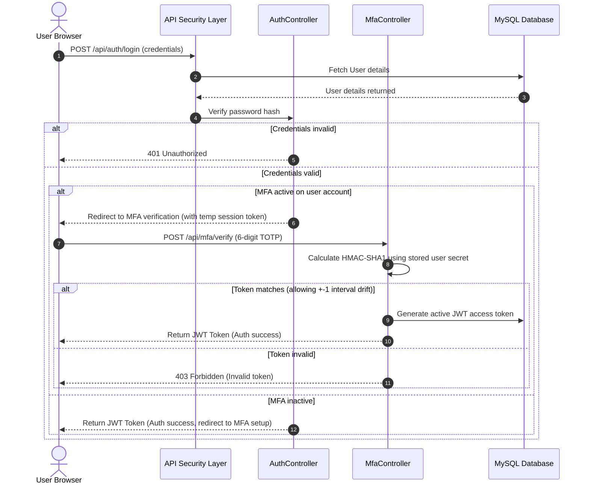
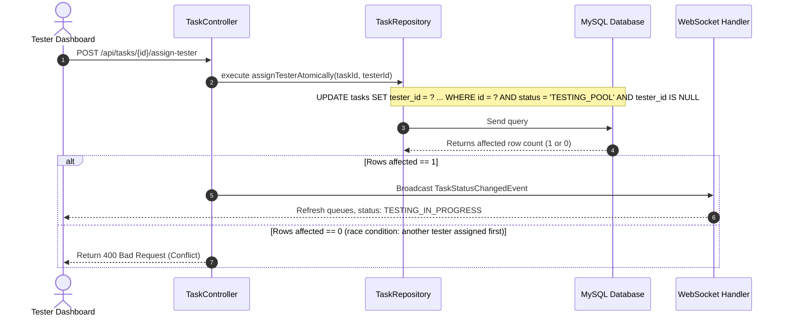

# Chapter 20: UML Diagrams, Flowcharts, and Coding Standards

This document contains visual diagrams mapping system sequences, component architectures, and coding standards.

---

## 20.1 Sequence Diagrams

### 1. Multi-Factor Authentication (MFA) Verification


### 2. Tester Self-Assignment Flow


---

## 20.2 Coding Standards & Naming conventions

### Exception Handling Rules
1. Never suppress exceptions with empty catch blocks.
2. In case of unexpected issues, write details to standard error stream (`System.err.println`) or raise a specific runtime exception (e.g. `AccessDeniedException`).
3. Return clean, parsed error models via `GlobalExceptionHandler` to prevent exposing stack traces to the client:
   ```json
   {
     "success": false,
     "message": "Error details here...",
     "timestamp": "2026-07-01T12:00:00"
   }
   ```

### Logging Rules
- System alerts and background logs should output clear chronological messages indicating the entity type, ID, operator, and action executed.
