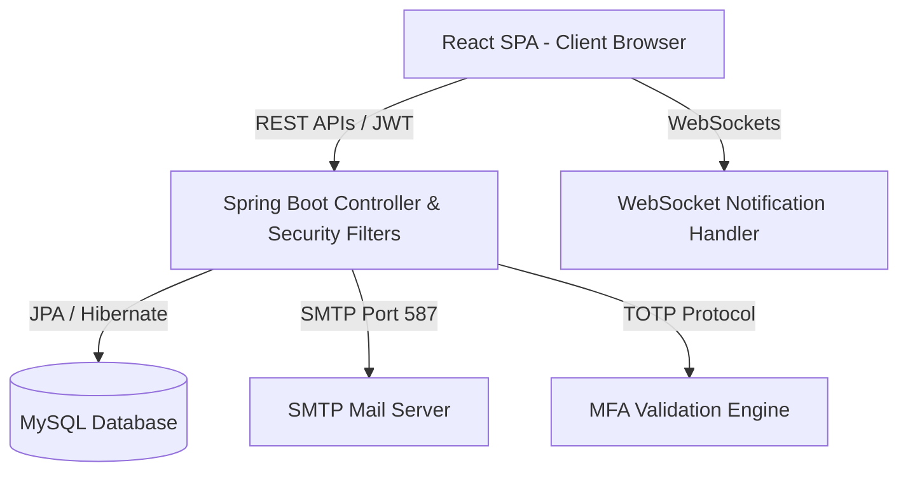
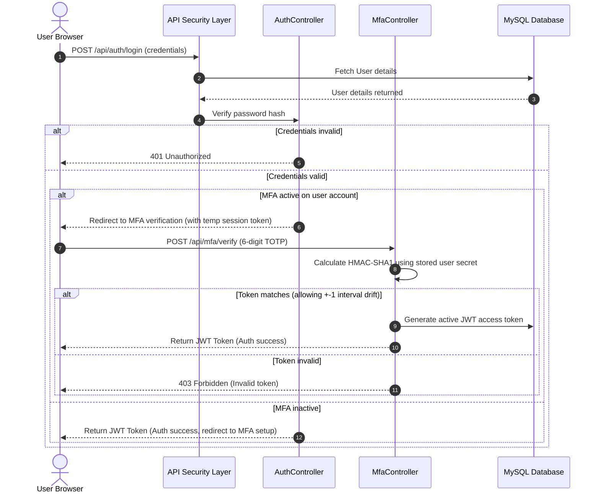
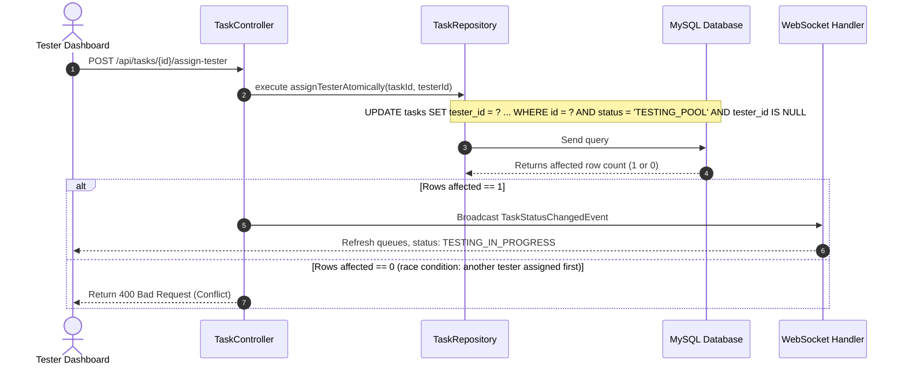

# DevTrack 2.0 Enterprise Technical Reference Suite

## Complete Documentation and System Specifications

---

# Chapter 1: Executive Summary

## 1.1 Project Vision
DevTrack 2.0 is an enterprise-grade Change Request (CR) management and deployment tracking platform. It bridges the gap between software development lifecycle (SDLC) activities and operational audit needs by providing an end-to-end trace of code approvals, test suite runs, and deployment environments. The platform empowers developers, testers, and administrators with clear dashboard workspaces, multi-factor security, and automated deployment records.

## 1.2 Business Objectives
- **Standardize CR Flow**: Enforce rigorous state transitions from draft development to production rollout.
- **Traceability & Auditing**: Maintain a chronological, tamper-proof history of every state change, code review approval, and user interaction.
- **Controlled Testing Lifecycles**: Prevent uncoordinated testing by assigning clear tester ownership and enforcing retesting pipelines for bugs.
- **MFA Compliance**: Enforce Multi-Factor Authentication (MFA) via Microsoft Authenticator to secure administrative and developer workspaces.

## 1.3 Target Users
- **Developers**: Create CRs, upload unit testing results, update code reviews, and address bugs.
- **Testers / QA Specialists**: Manage testing pool, self-assign tasks, log bugs, and sign off on SIT/UAT results.
- **Administrators**: Manage roles, approve code reviews, execute force reassignments, and audit platform activity.
- **Project Managers / Stakeholders**: View engineering analytics, audit trails, and deployment timelines.

## 1.4 Business Benefits
- **Decreased Deployment Lead Time**: Streamlined approvals and direct visibility of UAT state transitions speed up deployment cycles.
- **Zero-Trust Compliance**: High-grade MFA validation and security auditing logs protect production deploy sequences.
- **Enhanced Software Quality**: Clear tester boundaries, sticky bug assignments, and mandatory test artifact collection reduce regression leaks.

## 1.5 Technical Highlights
- **Spring Boot 3.3 Backend**: Powered by Java 21, JPA/Hibernate, and Spring Security.
- **React 18 / Vite Frontend**: SPA built with TypeScript, Tailwind CSS, Framer Motion, and Lucide React.
- **Atomic Database Locks**: Race-safe SQL queries for tester assignment preventing concurrent pick-ups.
- **Flyway Migrations**: Automated, versioned schema management keeping development and production databases synchronized.
- **TOTP / MFA Engine**: Fully offline verification using standard RFC 6238 TOTP algorithms.

## 1.6 Key Features
- **MFA Secure Sign-on**: Multi-factor authentication via Authenticator app with backup recovery codes.
- **Role-Based Workspaces**: Customized layouts and operations tailored to Developer, Tester, and Admin roles.
- **Sequential Pipeline**: Code approval directly unlocks UAT deployment and testing pools.
- **Sticky Testing Pool**: Testing queue allowing testers to self-assign tasks while preventing double-ownership.
- **Comprehensive Auditing**: Global trace showing SIT/UAT deploy/complete dates, code review approvals, and bug lifecycles.

## 1.7 Application Scope
- **In Scope**: CR lifecycle management, user management, TOTP MFA registration and verification, unit test artifact storage, bug tracking, and global auditing reports.
- **Out of Scope**: Direct Git hosting provider hosting (handled via branch/PR links), automated server hosting virtualization (deployments are logged manually or via webhooks).

## 1.8 Future Roadmap
- Deep integrations with GitHub, GitLab, and Azure DevOps for automated state movement on PR merges.
- AI-driven bug description and reproduction step parsing.
- Slack and Microsoft Teams notification channels.


---


# Chapter 2: Functional Requirement Specification (FRS)

This document specifies the functional requirements, user stories, acceptance criteria, rules, and exceptions for the core feature modules of DevTrack 2.0.

---

## 2.1 User Authentication & Multi-Factor Authentication (MFA)
### Description
Users must authenticate securely using their credentials. If MFA is enabled for the account, they must submit a valid Time-based One-Time Password (TOTP) from an authenticator application.

### User Story
*As a DevTrack 2.0 user, I want to log in using my credentials and MFA token, so that my account and workspace remain secure.*

### Acceptance Criteria
- Login screen must prompt for Username and Password.
- If MFA is active, user must be redirected to an MFA verification screen to input a 6-digit code.
- If MFA is not setup, the user is prompted to scan a QR code and set up MFA.
- Providing 10 recovery codes for download on first setup.

### Preconditions
- User account exists in the database.
- User is active.

### Postconditions
- JWT access and refresh tokens generated and stored in the client session.
- User is redirected to their role-specific dashboard workspace.

### Validation & Business Rules
- Username and password fields cannot be blank.
- The MFA token must be exactly 6 digits.
- The backend verifies TOTP using an RFC 6238-compliant algorithm with a time-step window of 30 seconds (allowing $\pm 1$ step clock drift).

### Exceptions
- Incorrect credentials return a generic `401 Unauthorized` response.
- Expired or invalid MFA tokens block login.
- Locked accounts due to excessive failed attempts block login.

### Success Criteria
- User successfully reaches their specific dashboard within 2 seconds.

---

## 2.2 Change Request (CR) Lifecycle & Pipeline Transitions
### Description
Allows developers to raise Change Requests (CRs), track them through environments (SIT, UAT), submit code reviews for approval, and promote them to Production.

### User Story
*As a Developer, I want to create a CR and advance it through pipeline gates, so that my code changes are audited, verified, and safely deployed.*

### Acceptance Criteria
- CR must contain Jtrack ID, Title, Project, Sprint, Category, Priority, and Description.
- Sequential gates: `OPEN` -> `IN_PROGRESS` -> `SIT_DEPLOYED` -> `SIT_COMPLETED` -> `CODE_REVIEW` -> `CODE_REVIEW_DONE` -> `MOVE_TO_UAT` -> `TESTING_POOL` -> `TESTING_IN_PROGRESS` -> `TESTING_COMPLETED` -> `CLOSED`.
- Uploading unit testing documents (Base64 file stream) is mandatory when pushing from `CODE_REVIEW_DONE` to `MOVE_TO_UAT`.

### Preconditions
- Developer is authenticated.
- Target project and sprint are active.

### Postconditions
- CR table record updated with new status, transition dates, and audit log.
- Notification sent to relevant parties (Admins, Reviewers, or Testers).

### Validation & Business Rules
- Jtrack ID must start with a valid prefix (e.g. `DT-` or `J-`) and be unique.
- Title and description must not be blank.
- Rejection during code review resets status to `IN_PROGRESS` and captures admin remarks.

### Exceptions
- Attempting to bypass workflow gates throws a validation exception.
- Missing unit testing documents blocks UAT push.

### Success Criteria
- Status transition takes place and updates dashboard states immediately.

---

## 2.3 Tester Assignment & UAT Testing
### Description
Once a CR is moved to UAT, it enters a shared Testing Pool. Testers self-assign CRs atomically. Only the assigned tester can test, raise bugs, or sign off on that CR.

### User Story
*As a Tester, I want to assign a CR to myself from the pool, so that I have exclusive ownership of its testing lifecycle.*

### Acceptance Criteria
- Shared pool is visible to all testers.
- "Assign to Me" button assigns the tester atomically.
- Once assigned, CR moves to "My Assigned Testing" tab and status updates to `TESTING_IN_PROGRESS`.
- If testing passes, tester logs completion comments and marks it as `TESTING_COMPLETED`.
- Admins can reassign a tester, requiring a mandatory textual reason.

### Preconditions
- CR is in `TESTING_POOL` status with no tester assigned.
- Tester is authenticated.

### Postconditions
- `tester_id` column set to the tester's ID.
- `testing_started_date` set to current timestamp.

### Validation & Business Rules
- Atomic check: The update query must verify `tester_id IS NULL` and `status = 'TESTING_POOL'` in the `WHERE` clause.
- Only the assigned tester can perform "Testing Passed" or "Raise Bug" actions on that CR.

### Exceptions
- Simultaneous clicks by two testers results in one success and a "CR already assigned" toast message for the other.

---

## 2.4 Bug Lifecycle & Retesting
### Description
Enables testers to raise bugs on assigned CRs, which automatically tags the CR as `BUG_FOUND` (displayed as `OPEN` in developer's active bugs queue). Once fixed, the tester retests the CR.

### User Story
*As a Tester, I want to raise a bug for a failed CR, so that the developer is notified and can fix the issue.*

### Acceptance Criteria
- Bug must include Title, Severity (Low, Medium, High, Critical), Description, Steps to Reproduce, Expected Result, and Actual Result.
- Once raised, CR status moves to `BUG_FOUND` and is routed to the developer's Bug Dashboard.
- When fixed, developer submits transition comments and marks the bug as `RESOLVED`.
- CR is returned back to the original assigning tester for verification.

### Preconditions
- CR is assigned to a tester and in `TESTING_IN_PROGRESS` status.

### Postconditions
- Bug record created in the `bugs` table.
- CR status updated to `BUG_FOUND`.

### Validation & Business Rules
- Jtrack ID must be provided.
- Description, steps to reproduce, expected result, and actual result cannot be blank.

### Exceptions
- Developers cannot self-approve or self-resolve bugs without entering transition comments.

### Success Criteria
- Bug shows up in the "Bugs & Defective CRs" tab for the tester, and in the "Assigned Bugs" list for the developer.


---


# Chapter 3: Software Requirement Specification (SRS)

This document establishes the hardware, software, browser, network, and third-party dependencies required to run, build, and deploy DevTrack 2.0.

---

## 3.1 System Requirements

### Hardware Requirements
- **Development Workstation / Server Host**:
  - **CPU**: Quad-core x86_64 processor (Intel Core i5/AMD Ryzen 5 or equivalent, minimum; 8-core recommended for enterprise deployment).
  - **Memory (RAM)**: Minimum 8 GB (16 GB recommended to run backend Spring Boot services, local MySQL instance, and React build watcher concurrently).
  - **Storage**: Minimum 10 GB free space (SSD recommended for fast build compiles).
- **Client (End User Workstation)**:
  - **Memory (RAM)**: Minimum 4 GB.
  - **Screen Resolution**: Minimum 1280x800 px (1920x1080 px recommended for dashboard layouts).

---

## 3.2 Software Requirements

### Development & Build Tools
- **Java Development Kit (JDK)**: JDK 17 or JDK 21 (Temurin / Adoptium build recommended).
- **Node.js**: v18.x or v20.x (LTS releases).
- **Build Managers**:
  - **Backend**: Apache Maven 3.8.x or 3.9.x.
  - **Frontend**: Vite 8.x with TypeScript compilation (`tsc`).
- **Database Engine**: MySQL 8.0+ or MariaDB 10.5+.
- **Database Migrations**: Flyway Core (integrated in Spring Boot build path).

---

## 3.3 Browser Support
DevTrack 2.0 uses modern styling paradigms including Glassmorphism (backdrop-filters), CSS grid layouts, and Framer Motion hardware-accelerated animations.
- **Google Chrome**: Version 100+ (fully supported).
- **Mozilla Firefox**: Version 102+ (fully supported).
- **Microsoft Edge**: Version 100+ (fully supported).
- **Apple Safari**: Version 15+ (fully supported).
- *Internet Explorer is not supported.*

---

## 3.4 Network Requirements
- **Protocol**: HTTP/1.1 or HTTP/2 over TLS (HTTPS) on production.
- **WebSocket Protocol**: `ws://` (development) and `wss://` (production) for in-app notification synchronization.
- **Port Allocations**:
  - **Port 8080**: Spring Boot web container (API and static assets server).
  - **Port 5173**: React local Vite hot-reload server (development only).
  - **Port 3306**: MySQL database daemon.
- **SMTP Gateway Access**: Outbound access on ports 25, 465, or 587 to connect to external email relays (SendGrid, AWS SES, or corporate Exchange servers).

---

## 3.5 Third-party Dependencies

### Backend (Spring Boot Core Starter Packages)
- `spring-boot-starter-web`: API routing and Tomcat servlet.
- `spring-boot-starter-security`: BCrypt encoding, JWT filter chains, and security configurations.
- `spring-boot-starter-data-jpa`: Hibernate ORM engine.
- `mysql-connector-j`: Database driver.
- `flyway-core` & `flyway-mysql`: Versioned database migration executor.
- `spring-boot-starter-websocket`: Real-time notification socket controller.
- `spring-boot-starter-mail`: SMTP client.
- `jjwt-api`, `jjwt-impl`, `jjwt-jackson`: JWT token parsing and generation.

### Frontend (npm Packages)
- `react` & `react-dom` (v18.x / v19.x)
- `react-router-dom` (v6.x)
- `zustand` (v4.x) - Light-weight state management.
- `framer-motion` & `lucide-react` - UI animation and iconography.
- `chart.js` & `react-chartjs-2` - Analytic visualization charts.
- `jspdf` & `html2canvas` - Client-side report exports.

---

## 3.6 Supported Operating Systems
- **Production Server**: Ubuntu Server 20.04 LTS / 22.04 LTS, Red Hat Enterprise Linux 8/9, or Windows Server 2019/2022.
- **Developer Local Environment**: Windows 10/11 (PowerShell/CMD), macOS (Ventura/Sonoma), or Linux (Ubuntu/Debian/Fedora).


---


# Chapter 4: System Architecture

This document presents the architectural blueprints, design patterns, component relationships, and execution pipelines of DevTrack 2.0.

---

## 4.1 High-Level Architecture
DevTrack 2.0 is structured as a decoupled Single Page Application (SPA) communicating over REST and WebSocket connections with a stateless Spring Boot microservice container.



---

## 4.2 Low-Level Architecture & Layered Patterns
The application enforces strict separation of concerns through standard enterprise layered patterns:
1. **Presentation Layer (Frontend)**: React components rendering views using global state fetched via Axios/Fetch API from Zustand stores.
2. **Controller Layer (API Gateway)**: REST controller endpoints map routes, validate payloads using `@Valid` annotations, and return HTTP ResponseEntities.
3. **Security Layer**: Intercepts requests, validates JWT authorization headers, sets SecurityContextHolder, and enforces endpoint-level annotations (`@PreAuthorize`).
4. **Service Layer (Business Logic)**: Transactional services (`@Service`) orchestrating database reads/writes, triggering system events, sending notifications, and running workflows.
5. **Data Access Layer (Repository)**: Spring Data JPA Repositories mapping database entities to queries.
6. **Database Layer**: MySQL relational storage managed by version-controlled Flyway SQL scripts.

---

## 4.3 Logical Architecture
```
+-------------------------------------------------------------------------------------------------+
|                                     React Frontend App                                          |
|  +-----------------------+   +------------------------+   +----------------------------------+  |
|  |       UI Views        |   |     State Stores       |   |       API Clients / Axios        |  |
|  | Developer/Tester/Admin|-->|  authStore, taskStore  |-->|  Sends JWT auth headers to       |  |
|  +-----------------------+   +------------------------+   |  REST backend endpoints          |  |
|                                                           +----------------------------------+  |
+-------------------------------------------------------------------------------------------------+
                                                |
                                                v
+-------------------------------------------------------------------------------------------------+
|                                    Spring Boot Backend REST Container                           |
|  +-----------------------+   +------------------------+   +----------------------------------+  |
|  |     Security Context   |   |   Controllers (APIs)   |   |        Service Layers            |  |
|  | JWT Validation Filter |-->| Task, Auth, Bug, Admin |-->| TaskService, AuthService, Mfa    |  |
|  +-----------------------+   +------------------------+   +----------------------------------+  |
|                                                                           |                     |
|                                                                           v                     |
|                                                           +----------------------------------+  |
|                                                           |      JPA Repository layer        |  |
|                                                           | TaskRepository, UserRepository   |  |
|                                                           +----------------------------------+  |
+-------------------------------------------------------------------------------------------------+
```

---

## 4.4 Deployment Architecture
- **Development**: Local compilation. React Vite dev-server runs on port 5173 proxying API requests to Spring Boot on port 8080.
- **SIT / UAT**: Static production build of React is compiled and copied into the backend's `/src/main/resources/static/` folder. Maven builds a single fat executable jar containing both client pages and backend server. Run via standard Java virtual machine.
- **Production**: Fat Jar runs behind an Nginx reverse-proxy handling SSL termination, rate-limiting, and static file caching.

---

## 4.5 Component Architecture
- **Auth Component**: Standard username/password validation, refresh token rotation, and Google Authenticator TOTP generator/verifier.
- **Workflow Engine**: Orchestrates transitions using status definitions and maps them to TaskWorkflowMap.
- **Attachment Component**: Encodes documents as Base64 binaries, storing them in dedicated `document_content` database blocks.
- **Notification Broker**: Listens for internal system events (e.g. `TaskStatusChangedEvent`, `BugCreatedEvent`) and dispatches simultaneous e-mails and WebSocket payloads.

---

## 4.6 Database Architecture & Transaction Isolation
- **Isolation Level**: Read Committed (MySQL default or configured).
- **Concurrency Strategy**: Optimistic locking where applicable. Tester self-assignment uses a modified query check (`tester IS NULL`) to guarantee atomic isolation.
- **Foreign Keys**: Enforced on database levels to guarantee referential integrity. Cascading deletes set on session configurations (`ON DELETE CASCADE`) for user configurations and preferences.

---

## 4.7 Security Architecture
- **Password Hashing**: BCrypt algorithm with a strength/work factor of 10.
- **JWT Lifetimes**: Access tokens expire in 15 minutes; Refresh tokens stored in HTTP-Only cookies with 7-day validity.
- **XSS Prevention**: Frontend purifies HTML content using `DOMPurify` before binding strings to elements.
- **SQL Injection**: Hibernate parameters bind inputs securely, preventing raw string concatenation in queries.


---


# Chapter 5: Technology Stack

This document details the technology stack of DevTrack 2.0, describing the purpose, version, selection rationale, and alternatives considered for each component.

---

## 5.1 Backend Technologies

### 1. Spring Boot
- **Purpose**: Core application framework, MVC routing, dependency injection, and JPA management.
- **Version**: 3.3.4
- **Reason for Selection**: Rapid scaffolding, built-in production-ready features (actuators, security), and mature ORM integration (Hibernate).
- **Alternatives Considered**: Node.js/Express (lacks out-of-the-box JPA/security ecosystem stability for enterprise database mapping), Go/Gin (requires manual SQL writing and lacks mature ORM capabilities).

### 2. Spring Security
- **Purpose**: Enforce role-based access control, manage CORS/CSRF configurations, and orchestrate JWT filters.
- **Version**: 6.3.3
- **Reason for Selection**: Highly customizable security filter chains that integrate natively with Spring Boot.
- **Alternatives Considered**: Keycloak (requires running a separate server, adding operations overhead), manual security filters (too error-prone).

### 3. MySQL
- **Purpose**: Relational database storage.
- **Version**: 8.0+
- **Reason for Selection**: Strict relational integrity, transaction locks, reliability, and widespread developer familiarity.
- **Alternatives Considered**: PostgreSQL (strong alternative, MySQL chosen for existing client hosting alignment), MongoDB (lack of strong foreign key guarantees and transactional constraints).

### 4. JSON Web Tokens (JWT)
- **Purpose**: Stateless client authentication.
- **Version**: JJWT v0.12.x
- **Reason for Selection**: Prevents the need to store session states in the backend memory, allowing easy scale-out.
- **Alternatives Considered**: Session cookies (requires sticky sessions or Redis session replication).

### 5. Flyway
- **Purpose**: Database schema migration tracking.
- **Version**: Core 10.x
- **Reason for Selection**: Schema migrations are versioned SQL scripts committed to git, avoiding schema drift.
- **Alternatives Considered**: Liquibase (uses verbose XML/YAML files; Flyway's pure SQL approach is preferred by DBAs).

### 6. JavaMail
- **Purpose**: Send SMTP emails for alerts and MFA notifications.
- **Version**: Spring Boot Starter Mail (Jakarta Mail)
- **Reason for Selection**: Standardized API with built-in connection pooling and asynchronous template dispatch.
- **Alternatives Considered**: Direct HTTP API integrations (e.g. SendGrid Client, AWS SES Client) - binds application code to specific vendors.

---

## 5.2 Frontend Technologies

### 1. React
- **Purpose**: Component-based single-page application framework.
- **Version**: 18.2+
- **Reason for Selection**: Virtual DOM performance, rich component ecosystems (Lucide, Framer Motion), and declarative state mapping.
- **Alternatives Considered**: Angular (steeper learning curve, heavier bundle size), Vue (lighter, but React has a wider collection of UI blueprints).

### 2. TypeScript
- **Purpose**: Static type checking.
- **Version**: 5.x
- **Reason for Selection**: Catches component property bugs and state changes during compile-time.
- **Alternatives Considered**: Vanilla JavaScript (unsafe, harder to maintain as codebase scales).

### 3. Zustand
- **Purpose**: Global client state management.
- **Version**: 4.5.x
- **Reason for Selection**: Zero boilerplate compared to Redux, extremely lightweight, and integrates perfectly with local storage synchronization.
- **Alternatives Considered**: Redux Toolkit (unnecessary boilerplate for a medium-scale platform), React Context API (re-renders all sub-components on any state change).

### 4. Framer Motion
- **Purpose**: Fluent micro-animations and gesture animations.
- **Version**: 11.x
- **Reason for Selection**: High-performance CSS transitions, exit animation states (`AnimatePresence`), and simple declarative props.
- **Alternatives Considered**: Anime.js or GSAP (more complex to integrate with React life-cycles).

### 5. Playwright
- **Purpose**: End-to-end (E2E) testing framework.
- **Version**: 1.4x
- **Reason for Selection**: Fast parallel executions, headless browser testing, and simple auto-waiting selectors.
- **Alternatives Considered**: Cypress (runs inside browser context making multi-tab and system integrations harder), Selenium (slow, requires manual driver installations).


---


# Chapter 6: Project Structure

This document details the folder hierarchy, packaging patterns, naming conventions, and file organization of DevTrack 2.0.

---

## 6.1 Root Directory Hierarchy
```
DevTracker/
├── backend/               # Spring Boot 3.3.4 Source Code
├── frontend/              # React + Vite + TS SPA Source Code
├── docs/                  # System Technical Reference Manuals (This Folder)
└── README.md
```

---

## 6.2 Backend Directory Structure
The backend is structured as a standard Maven single-module layout. The Java classes reside under `src/main/java/com/devtrack/api/` and resources under `src/main/resources/`.

```
backend/
├── pom.xml
└── src/
    └── main/
        ├── java/com/devtrack/api/
        │   ├── DevtrackApplication.java      # Boot Entry Point
        │   ├── config/                       # CORS, Web MVC, WebSocket configs
        │   ├── controller/                   # REST API Controllers
        │   ├── dto/                          # Data Transfer Objects (Payload models)
        │   ├── event/                        # Spring ApplicationEvent definitions
        │   ├── model/                        # JPA Entities (Hibernate mappings)
        │   ├── notification/                 # Email templates and dispatchers
        │   ├── repository/                   # JPA Repositories (Database access)
        │   ├── security/                     # Spring Security filters & JWT utilities
        │   └── services/                     # Business services & workflow execution
        └── resources/
            ├── application.properties        # App configs, Database credentials
            ├── db/migration/                 # Flyway SQL schema scripts (V1 -> V10)
            └── templates/                    # Thymeleaf email templates
```

### Packaging Conventions
- `config/`: Contains beans for third-party setup (Web Security, WebSockets, AppConfig).
- `controller/`: REST layer endpoints. Direct interactions with database entities are strictly avoided here; business services are invoked instead.
- `model/`: Defines database table structures using `@Entity` annotations.
- `repository/`: Extension of `JpaRepository` representing CRUD operations.
- `services/`: Contains interfaces and implementation classes containing transactions (`@Transactional`).

---

## 6.3 Frontend Directory Structure
The client app is a single page application built on Vite + React + TypeScript.

```
frontend/
├── index.html
├── package.json
├── tsconfig.json
├── vite.config.ts
└── src/
    ├── main.tsx             # React SPA mounting root
    ├── App.tsx              # Base router and layout binding
    ├── index.css            # Custom CSS styles
    ├── components/
    │   ├── shared/          # Reusable drawer panels and modals
    │   └── ui/              # Atom level elements (Button, Cards, Input)
    ├── pages/               # Routed page panels (Dashboards, Sprints, Login)
    ├── services/            # Mock schemas & API connection clients
    └── store/               # Zustand global store files (authStore, taskStore)
```

---

## 6.4 Naming Conventions

### File & Class Names
- **Java Classes**: PascalCase (e.g. `TaskController`, `WorkflowExecutionService`).
- **TypeScript Component Files**: PascalCase (e.g. `DeveloperDashboard.tsx`, `BugDetailModal.tsx`).
- **TypeScript Store Files**: camelCase (e.g. `taskStore.ts`, `authStore.ts`).
- **Database Tables**: Plural lowercase with underscores (e.g. `tasks`, `bugs`, `audit_logs`).
- **Database Columns**: snake_case (e.g. `testing_started_date`, `assigned_developer_id`).

### Code Style Guidelines
- **Braces**: K&R style (braces open on the same line as the statement).
- **Indentation**: 2 spaces for TypeScript/CSS, 4 spaces for Java/XML.
- **REST Resource Paths**: plural-lowercase (e.g. `/api/tasks`, `/api/bugs`).


---


# Chapter 7: Database Documentation

This document describes the schema architecture, column details, relational integrity, constraints, and operational patterns for the database of DevTrack 2.0.

---

## 7.1 Schema Catalog

### 1. `users` Table
- **Purpose**: Holds authenticated accounts and roles.
- **Columns**:
  - `id` (BIGINT, Primary Key, Auto Increment)
  - `username` (VARCHAR(255), Unique, Not Null)
  - `password` (VARCHAR(255), Not Null) - BCrypt hash.
  - `full_name` (VARCHAR(255), Not Null)
  - `email` (VARCHAR(255), Unique, Not Null)
  - `mfa_enabled` (TINYINT(1), Default 0)
  - `mfa_secret` (VARCHAR(255), Nullable)
- **APIs using it**: `/api/auth/login`, `/api/auth/register`, `/api/users`.

### 2. `tasks` Table
- **Purpose**: Stores Change Requests (CRs) and tracking metadata.
- **Columns**:
  - `id` (BIGINT, Primary Key, Auto Increment)
  - `jtrack_id` (VARCHAR(100), Unique, Not Null)
  - `title` (VARCHAR(255), Not Null)
  - `description` (TEXT)
  - `status` (VARCHAR(100), Not Null) - Active status enum string.
  - `priority` (VARCHAR(50), Default 'Medium')
  - `efforts` (INT, Default 0) - Efforts in days.
  - `created_date` (DATETIME, Not Null)
  - `updated_date` (DATETIME)
  - `assigned_developer_id` (BIGINT, Foreign Key -> `users(id)`)
  - `tester_id` (BIGINT, Foreign Key -> `users(id)`)
  - `testing_started_date` (DATETIME)
  - `testing_completed_date` (DATETIME)
  - `testing_duration` (VARCHAR(255))
  - `testing_comments` (VARCHAR(2000))
  - `total_bugs_raised` (INT, Default 0)
  - `total_retests` (INT, Default 0)
  - `reassignment_reason` (VARCHAR(2000))
  - `reassignment_date` (DATETIME)
  - `previous_tester_id` (BIGINT, Foreign Key -> `users(id)`)
  - `reassigned_by_id` (BIGINT, Foreign Key -> `users(id)`)
  - `unit_test_doc_url` (LONGTEXT) - Base64 encoded test document.
  - `unit_test_doc_name` (VARCHAR(512))
- **APIs using it**: `/api/tasks/*`, `/api/tasks/{id}/assign-tester`, `/api/tasks/{id}/reassign-tester`.

### 3. `bugs` Table
- **Purpose**: Logs defects raised during testing on specific CRs.
- **Columns**:
  - `id` (BIGINT, Primary Key, Auto Increment)
  - `cr_task_id` (BIGINT, Foreign Key -> `tasks(id)`)
  - `title` (VARCHAR(255), Not Null)
  - `description` (TEXT)
  - `severity` (VARCHAR(50), Not Null)
  - `status` (VARCHAR(100), Default 'OPEN')
  - `assigned_developer_id` (BIGINT, Foreign Key -> `users(id)`)
  - `raised_by_id` (BIGINT, Foreign Key -> `users(id)`)
  - `created_date` (DATETIME)
  - `updated_date` (DATETIME)
  - `reason` (VARCHAR(2000))
  - `steps_to_reproduce` (VARCHAR(2000))
  - `expected_result` (VARCHAR(2000))
  - `actual_result` (VARCHAR(2000))
- **APIs using it**: `/api/bugs/*`.

### 4. `audit_logs` Table
- **Purpose**: Stores historical system logs.
- **Columns**:
  - `id` (BIGINT, Primary Key, Auto Increment)
  - `entity_type` (VARCHAR(100), Not Null) - e.g. 'TASK', 'BUG', 'USER'
  - `entity_id` (BIGINT, Not Null)
  - `action` (VARCHAR(255), Not Null) - e.g. 'STATUS_CHANGE', 'ASSIGNMENT'
  - `field_name` (VARCHAR(100))
  - `old_value` (TEXT)
  - `new_value` (TEXT)
  - `remarks` (TEXT)
  - `changed_by_username` (VARCHAR(255))
  - `changed_date` (DATETIME, Default CURRENT_TIMESTAMP)
- **APIs using it**: `/api/audit-logs/*`.

---

## 7.2 Entity-Relationship (ER) Diagram (Conceptual)
```
  +--------------+               +------------------+
  |    users     | 1         0..*|      tasks       |
  |--------------|-------------->|------------------|
  | id (PK)      |               | id (PK)          |
  | username     |               | jtrack_id (UK)   |
  | password     |               | status           |
  | email        |               | dev_id (FK)      |
  +--------------+               | tester_id (FK)   |
         |                       +------------------+
         |                                | 1
         |                                |
         | 1                              | 0..*
         |                                v
         |                       +------------------+
         |                       |      bugs        |
         |                       |------------------|
         +---------------------->| id (PK)          |
                                 | cr_task_id (FK)  |
                                 | status           |
                                 | raised_by (FK)   |
                                 +------------------+
```

---

## 7.3 Data Ownership & Lifecycle
- **Who updates data**:
  - **Developers**: Update Task properties when coding, upload Unit Test docs, resolve bugs.
  - **Testers**: Self-assign tasks, update test duration/retests, raise bugs.
  - **Admins**: Add/modify users, reassign tester fields with audit justification, change global statuses.
- **When is it updated**: Triggered instantly on GUI button submission or API REST POST execution.
- **Soft Delete Rules**: Hard deletes are generally avoided for tasks and bugs; records remain in database and are filtered out via UI states.


---


# Chapter 8: API Documentation

This document describes the REST endpoints exposed by the DevTrack 2.0 backend, specifying the request models, headers, validation constraints, and database side effects.

---

## 8.1 Authentication & Registration Endpoints

### 1. Register User
- **HTTP Method**: `POST`
- **URL**: `/api/auth/register`
- **Headers**: `Content-Type: application/json`
- **Request Body**:
  ```json
  {
    "username": "tester1",
    "password": "SecurePassword123",
    "fullName": "Alice Tester",
    "email": "tester1@devtrack.com",
    "roles": ["TESTER"]
  }
  ```
- **Validation Rules**:
  - `username`: Not blank, unique, min 4 chars.
  - `password`: Not blank, min 8 chars.
  - `email`: Valid email format.
- **Success Response (`200 OK`)**:
  ```json
  {
    "success": true,
    "message": "User registered successfully."
  }
  ```
- **Failure Response (`400 Bad Request`)**:
  ```json
  {
    "success": false,
    "message": "Username already exists."
  }
  ```
- **Business Logic**: Hashes password with BCrypt, saves record to `users` table.

---

## 8.2 Task / CR Endpoints

### 1. Get All Tasks
- **HTTP Method**: `GET`
- **URL**: `/api/tasks`
- **Authentication**: Bearer JWT token required in `Authorization` header.
- **Success Response (`200 OK`)**:
  ```json
  [
    {
      "id": 1,
      "jtrackId": "DT-101",
      "title": "Setup Login Screen",
      "status": "OPEN",
      "priority": "High",
      "assignedDeveloper": { "id": 2, "fullName": "Bob Dev" },
      "tester": null
    }
  ]
  ```

### 2. Assign Tester Atomically
- **HTTP Method**: `POST`
- **URL**: `/api/tasks/{id}/assign-tester`
- **Authentication**: Bearer JWT token. User role must be `TESTER` or `TESTADMIN`.
- **Success Response (`200 OK`)**:
  ```json
  {
    "id": 1,
    "jtrackId": "DT-101",
    "status": "TESTING_IN_PROGRESS",
    "tester": { "id": 3, "fullName": "Alice Tester" },
    "testingStartedDate": "2026-07-01T12:00:00"
  }
  ```
- **Failure Response (`400 Bad Request`)**:
  ```json
  {
    "success": false,
    "message": "CR already assigned or not in testing pool."
  }
  ```
- **Database Side Effects**:
  - Updates `tasks` table: sets `tester_id = CURRENT_USER_ID`, `status = 'TESTING_IN_PROGRESS'`, `testing_started_date = NOW()`.
  - Creates record in `audit_logs`.

### 3. Reassign Tester (Admin Only)
- **HTTP Method**: `POST`
- **URL**: `/api/tasks/{id}/reassign-tester`
- **Authentication**: Bearer JWT token. User role must be `ADMIN`.
- **Request Body**:
  ```json
  {
    "newTesterUsername": "tester2",
    "reason": "Initial tester went on leave."
  }
  ```
- **Success Response (`200 OK`)**:
  ```json
  {
    "id": 1,
    "status": "TESTING_IN_PROGRESS",
    "tester": { "id": 5, "fullName": "Charlie Tester" },
    "previousTester": { "id": 3, "fullName": "Alice Tester" },
    "reassignmentReason": "Initial tester went on leave."
  }
  ```
- **Database Side Effects**:
  - Updates `tasks` table: sets `tester_id = NEW_TESTER_ID`, `previous_tester_id = OLD_TESTER_ID`, `reassignment_reason = REASON`, `reassignment_date = NOW()`, `reassigned_by_id = ADMIN_ID`.
  - Increments `total_retests` on the task.
  - Inserts `audit_logs` record.

---

## 8.3 Bug Endpoints

### 1. Create Bug
- **HTTP Method**: `POST`
- **URL**: `/api/bugs`
- **Authentication**: Bearer JWT token.
- **Request Body**:
  ```json
  {
    "jtrackId": "DT-101",
    "title": "Login crash on blank input",
    "description": "App crashes when submit is clicked without inputs.",
    "severity": "Critical",
    "reason": "NullPointerException in login validation",
    "stepsToReproduce": "1. Go to login page\n2. Click Submit",
    "expectedResult": "Validation error displayed",
    "actualResult": "Blank white screen (app crash)"
  }
  ```
- **Success Response (`200 OK`)**:
  ```json
  {
    "id": 12,
    "title": "Login crash on blank input",
    "status": "OPEN",
    "severity": "Critical",
    "crTaskId": 1
  }
  ```
- **Database Side Effects**:
  - Inserts record into `bugs` table.
  - Updates associated task in `tasks` table: sets `status = 'BUG_FOUND'`, increments `total_bugs_raised`.
  - Inserts `audit_logs` record.
  - Dispatches WebSocket and SMTP email notifications to the assigned developer.


---


# Chapter 9: Workflow Documentation

This document describes the operational workflows, state machines, and approval gates driving DevTrack 2.0.

---

## 9.1 Authentication & Multi-Factor Setup (MFA)
### Workflow Steps
1. User enters username and password.
2. If correct, backend checks if MFA is active:
   - **MFA Active**: Redirects client to `/mfa-verify`. User inputs 6-digit TOTP code. If valid, JWT is generated.
   - **MFA Inactive**: User registers MFA. Backend generates a 32-character secret key, creates a QR code image (using Google Authenticator URI schema), and generates 10 single-use recovery codes.
3. User scans QR code using Microsoft Authenticator or any RFC 6238 app and inputs the first 6-digit token to confirm.
4. Validation success activates MFA flag on user account.

---

## 9.2 Change Request (CR) Lifecycle
```
[Draft Development] --> (Submit Code Review) --> [Code Review (Pending Admin)]
                                                     |
                                   +-----------------+-----------------+
                                   |                                   |
                          (Approved by Admin)                 (Rejected by Admin)
                                   |                                   |
                                   v                                   v
                         [Code Review Done]                  [Changes Requested]
                                   |                                   |
                        (Upload Unit Test Doc)                 (Fix & Resubmit)
                                   v                                   |
                         [Move to UAT / Pool] <------------------------+
                                   |
                         (Tester Self-Assigns)
                                   v
                       [Testing In Progress]
                                   |
                   +---------------+---------------+
                   |                               |
             (Pass Testing)                  (Fail / Raise Bug)
                   |                               |
                   v                               v
          [Testing Completed]                 [Bug Found / Open]
                   |                               |
          (Promote to Prod)                  (Developer Fixes)
                   |                               |
                   v                               v
               [Closed]                      [Bug Resolved]
                                                   |
                                            (Tester Retests)
                                                   v
                                         [Testing In Progress]
```

---

## 9.3 Bug Lifecycle & Retests
- **Raising Bug**: Tester inputs bug details on an assigned CR. Associated task status changes to `BUG_FOUND`. The task's `total_bugs_raised` field is incremented.
- **Resolving Bug**: Developer completes fix, writes comments, and marks as `RESOLVED`.
- **Retesting**: The bug is routed back to the assigning tester. Task returns to `TESTING_IN_PROGRESS`. Tester performs verification. If verified, tester closes the bug. If verified and all bugs on the CR are resolved, UAT testing can be marked passed.

---

## 9.4 Deployment & Releases
- **SIT Deployment**: Handled manually or via webhooks. Developer marks status as `SIT_DEPLOYED`. Audit logs track deployment date.
- **UAT Deployment**: Developer must upload a unit testing document (Base64 file stream) to advance status from `CODE_REVIEW_DONE` to `MOVE_TO_UAT`. Document name and base64 string are stored directly.
- **Prod Promotion**: Admin moves task from `TESTING_COMPLETED` (or `UAT_COMPLETED`) to `CLOSED`. This marks the end of the CR lifecycle.


---


# Chapter 10: Dashboard Documentation

This document describes the role-specific dashboards, workspace metrics, widget designs, and state behaviors implemented in DevTrack 2.0.

---

## 10.1 Developer Dashboard
- **Purpose**: Personalized workspace for developers to track active development tasks, address raised bugs, and transition tasks from creation to UAT release.
- **Widgets & Widgets Layout**:
  - **KPI Cards**: Count of Active CRs, Pending Reviews, and Open Assigned Bugs.
  - **My Active Workspace (Table)**: List of assigned CRs matching search query. Actions include: Start Development, Deploy to SIT, Verify & Complete SIT, and Submit for Code Review.
  - **My Assigned Bugs (Table)**: List of bugs assigned to the developer. Developer can click a bug, view steps to reproduce, and submit a fix comment to mark it as `RESOLVED`.
  - **Status Update Drawer**: Right-anchored sliding panel containing fields for comments and files (proof of testing screenshot, unit testing document).
- **Permissions**: View and edit only self-assigned tasks and bugs.
- **API Calls**: `GET /api/tasks`, `GET /api/bugs`, `POST /api/tasks/{id}/status`.

---

## 10.2 Tester Dashboard
- **Purpose**: Shared workspace for quality engineers to self-assign tasks from the pool, log defects, and approve testing runs.
- **Tabs / Sub-Queues**:
  - **Testing Pool**: Shows CRs in UAT state with no tester (`TESTING_POOL`). Actions: "Assign to Me".
  - **My Assigned Testing**: CRs self-assigned by the current tester. Actions: "Raise Bug" (opens modal), "Testing Passed" (promotes to `TESTING_COMPLETED`).
  - **Bugs & Defective CRs**: Defective CRs showing open bugs. Shows all relevant information logged during the bug-raising stage.
- **Permissions**: View all UAT items; assign tasks to self; raise and close bugs for self-assigned tasks.
- **API Calls**: `GET /api/tasks`, `POST /api/tasks/{id}/assign-tester`, `POST /api/bugs`.

---

## 10.3 Admin Dashboard (CR Management & Configs)
- **Purpose**: Global control room for system configurations, role management, code review approvals, audit trails, and tester reassignment.
- **Views**:
  - **CR Management (Table)**: Comprehensive list of all CRs. Displays detailed transition dates (SIT deploy, SIT completed, UAT deploy, testing completed, bug raised/resolved, UAT completed, prod deploy dates).
  - **Admin Action Panel (Drawer)**: Allows code reviews approval/rejection and tester reassignments (requiring a mandatory justification reason).
  - **MFA Reset View**: Reset MFA for locked out users.
  - **User Configs Table**: Lists user roles and credentials.
- **Permissions**: System-wide view, edit, approve, reassign, and configuration access.
- **API Calls**: `GET /api/users`, `POST /api/tasks/{id}/reassign-tester`, `POST /api/auth/approve-cr`.


---


# Chapter 11: UI Documentation

This document describes the design systems, UI components, states, and client interactions implemented in the React frontend of DevTrack 2.0.

---

## 11.1 Design System & Aesthetic Directives
DevTrack 2.0 uses a modern **Glassmorphic Dark UI Theme** with deep violet-blue gradients.
- **Color Palette**:
  - Primary Background: `#060814` (Deep space slate).
  - Component Container: `rgba(255, 255, 255, 0.03)` with standard CSS backdrop blur (`backdrop-blur-md`).
  - Board Border: `rgba(255, 255, 255, 0.06)`.
  - Accents: Violet (`rgb(139, 92, 246)`), Cyan (`rgb(34, 211, 238)`), Emerald (`rgb(16, 185, 129)`), Rose/Red (`rgb(244, 63, 94)`).
- **Typography**: Inter (Google Fonts) with strict letter-spacing mapping.

---

## 11.2 Core Components & Layouts

### 1. Interactive Drawer (Right Slide-out Panel)
- **Files**: Embedded directly inside dashboard pages (`developerDashboard.tsx`, `testerDashboard.tsx`, `crManagement.tsx`).
- **Features**: Smooth spring entry and exit animations powered by Framer Motion's `<AnimatePresence>`.
- **States**:
  - Empty: Displays "Select a Change Request to view detailed progress and transitions" in styled muted slate.
  - Active: Renders CR metadata, audit logs, screenshots (with download triggers), and contextual transition buttons.

### 2. Modals (Raise Bug & Bug Details)
- **RaiseBugModal**: Standard React modal overlay containing fields for Title, Severity dropdown, Reason, Steps to Reproduce, Expected Result, and Actual Result. Form inputs check for blank strings before submitting.
- **BugDetailModal**: View-only drawer details showing the complete bug lifecycle, severity indicator pill, and reporter comments.

---

## 11.3 Interactive Elements & States
- **Animations**:
  - Sidebar Hover: Muted scale increase and glow effect.
  - Cards: Soft translateY hover offset (`-4px`) and shadow transitions.
- **Loading States**: Uses pulse placeholders (Skeleton screens) and spinner SVGs.
- **Empty States**: Customized visual vector containers indicating "No tasks found" with styled descriptive subtexts.
- **Tooltips**: Dynamic native browser title attributes and customized text boxes detailing status definitions on hover.


---


# Chapter 12: Role-Based Access Control (RBAC)

This document maps user roles to specific permission rules and authorization scopes within the DevTrack 2.0 application workspace.

---

## 12.1 Permissions Matrix by Role

| Workspace Action | ADMIN | DEVELOPER | TESTER | TESTADMIN |
|---|:---:|:---:|:---:|:---:|
| **View CR details** | Yes | Yes | Yes | Yes |
| **Create new CR** | Yes | Yes | No | No |
| **Update CR status (Dev States)** | No | Yes (Only Assigned) | No | No |
| **Approve Code Review** | Yes | No | No | No |
| **Deploy/Move to UAT** | No | Yes (Only Assigned) | No | No |
| **Self-Assign Tester** | No | No | Yes | Yes |
| **Reassign Tester** | Yes | No | No | Yes |
| **Upload Unit Test Document** | No | Yes | No | No |
| **Download Unit Test Document** | Yes | Yes | Yes | Yes |
| **Raise Bug** | No | No | Yes | Yes |
| **Resolve Bug** | No | Yes (Only Assigned) | No | No |
| **Close Bug** | No | No | Yes | Yes |
| **Reset MFA Secrets** | Yes | No | No | No |
| **View Audit Logs** | Yes | Yes | Yes | Yes |

---

## 12.2 Workspace Authorization Flow

- **Backend Enforcement**:
  Backend REST controllers use Spring Security annotations (e.g. `@PreAuthorize("hasRole('ADMIN')")` or custom evaluation checks based on task ownership).
  ```java
  @PreAuthorize("hasAnyRole('TESTER', 'TESTADMIN')")
  @PostMapping("/{id}/assign-tester")
  public ResponseEntity<?> assignTester(...) { ... }
  ```
- **Frontend Enforcement**:
  The user role is cached in the client session state (`useAuthStore`). Render methods use conditional operators to hide or display buttons:
  ```typescript
  {user?.roles?.includes('ADMIN') && (
    <Button onClick={handleReassign}>Reassign Tester</Button>
  )}
  ```
- **Future Roles**:
  The database schema stores roles as collections of strings, enabling simple future additions of roles such as `PROJECT_MANAGER` or `RELEASE_ENGINEER` by adding new entries to the user role mappings without schema modifications.


---


# Chapter 13: Security Documentation

This document describes the security protocols, encryption algorithms, network constraints, and vulnerability protections implemented in DevTrack 2.0.

---

## 13.1 Authentication & Secrets Management

### 1. Password Encryption (BCrypt)
- **Algorithm**: BCrypt password-hashing function (based on Blowfish cipher).
- **Configuration**: Standard Spring Security `BCryptPasswordEncoder` using a work factor of 10.
- **Data Store**: Salt is embedded within the generated hash string stored under `password` in the `users` table.

### 2. Time-Based One-Time Passwords (TOTP / MFA)
- **Specification**: Compliance with **RFC 6238** (TOTP: Time-Based One-Time Password Algorithm) and **RFC 4226** (HOTP).
- **Algorithm**: HMAC-SHA1 using a 32-character Base32 encoded shared secret.
- **Verification Window**: 30 seconds. Clock drift tolerance is set to $\pm 1$ step (allowing codes within a 90-second window to authenticate).
- **Recovery Codes**: 10 cryptographically secure, random 10-character alphanumeric codes generated using secure random number generators (`SecureRandom`) during registration. Once used, the code is invalidated in the database (`mfa_backup_codes` table).

---

## 13.2 Session & Network Security

### 1. JSON Web Tokens (JWT)
- **Signature Algorithm**: HMAC-SHA256 (HS256) signed using a secure 256-bit environment secret (`jwt.secret`).
- **Validation**: Performed by `JwtAuthenticationFilter` extending `OncePerRequestFilter`.
- **Claims**: Contains Subject (username), Issued-At (`iat`), Expiry (`exp`), and authorities.

### 2. CORS (Cross-Origin Resource Sharing)
- **Development**: Dev-server proxies requests to `/api` from port 5173 to port 8080.
- **Production**: Configured inside `WebConfig` and `SecurityConfig` to restrict origins to verified system domains. Allowed headers include `Authorization`, `Content-Type`, and `X-Requested-With`.

### 3. File Validation & Sanitization
- When developers upload unit testing documents:
  - Filename checked for directory traversal attempts (e.g. `../`).
  - Size verified against a backend limit of 10 MB.
  - MIME-type checked against approved lists (PDF, DOCX, PNG, JPG).
- Base64 payload is parsed and stored inside `document_content(content)` as a raw binary blob.


---


# Chapter 14: Notification Documentation

This document describes the notification subsystem, messaging channels, layout templates, and dispatch rules utilized in DevTrack 2.0.

---

## 14.1 Notification Channels

### 1. WebSocket In-App Notifications
- **Protocol**: Raw WebSocket connection managed via a custom endpoint `/ws/notifications`.
- **Implementation**: The handler `NotificationWebSocketHandler` intercepts the handshake, extracts user context, maps connection sessions, and broadcasts dynamic JSON alerts.
- **Payload format**:
  ```json
  {
    "id": 45,
    "title": "Bug Raised",
    "message": "Alice Tester raised Bug DT-101-B1 on your task Setup Login Screen.",
    "type": "BUG_RAISED",
    "timestamp": "2026-07-01T12:00:00"
  }
  ```

### 2. SMTP Email Notifications
- **Implementation**: Managed by the Spring Boot starter mail package. Connects to the configured external SMTP host to dispatch HTML emails.
- **Templates**: Thymeleaf HTML files located under `src/main/resources/templates/mail/`. Includes placeholders for target usernames, task IDs, actions, and redirect links.

---

## 14.2 Recipient Dispatch Rules

| System Event | Primary Recipient | Notification Channel | Content Summary |
|---|---|---|---|
| **CR Submitted for Review** | System Admins | Email + In-App | Alerting admins to review Jtrack CR |
| **CR Code Approved** | Assigned Developer | In-App | Confirmation of review approval |
| **Bug Raised** | Assigned Developer | Email + In-App | Bug details, severity, steps to reproduce |
| **Bug Resolved** | Assigned Tester | In-App | Fix comments, prompting regression test |
| **Tester Assigned** | Developer & Admins | In-App | Notification of tester pick-up |
| **MFA Code Reset** | Target User | Email | Recovery codes generated and sent |

---

## 14.3 Retry & Error Handling Policies
- **Asynchronous Execution**: Email dispatching runs asynchronously (`@Async`) to prevent blocking API response threads.
- **SMTP Failure**: If SMTP connection fails (e.g. timeout, invalid credentials), exceptions are caught, logged via `System.err.println`, and saved in the database under an error audit flag.
- **Fallback**: WebSocket channel remains active if email transport fails.


---


# Chapter 15: File Management

This document describes how documents, screenshots, and test artifacts are uploaded, stored, validated, and downloaded within DevTrack 2.0.

---

## 15.1 Upload Constraints & Protocols

### Supported File Types
- **Unit Testing Documents**: `.pdf`, `.docx`, `.txt`, `.xlsx`.
- **Proof of Testing Screenshots**: `.png`, `.jpg`, `.jpeg`.
- **Bug Attachments**: `.zip`, `.log`, `.txt`, `.png`, `.jpg`.

### Size Limitations
- Maximum single file upload size is set to **10 MB** (enforced by Spring Boot Web MVC multiparts configurations `spring.servlet.multipart.max-file-size` and verified on client-side prior to Base64 serialization).

---

## 15.2 Storage Architecture & Database Schema

Unlike traditional setups that store files on disk, DevTrack 2.0 uses a database-backed storage strategy to avoid file sync synchronization issues across load-balanced application instances.

### 1. `document` Entity
- **Properties**:
  - `id` (Long, PK)
  - `fileName` (String) - Original user filename.
  - `fileType` (String) - MIME-type descriptor (e.g. `image/png`).
  - `uploadedDate` (LocalDateTime)
  - `uploadedBy` (User)

### 2. `document_content` Entity
- **Properties**:
  - `documentId` (Long, PK, Foreign Key -> `document(id)` on delete cascade)
  - `content` (MediumBlob / LongText) - Holds base64 encoded byte content.

---

## 15.3 Download Mechanism
1. Client clicks the download link.
2. React store calls `apiClient` or fetches the Base64 data from the record.
3. React store converts the Base64 stream back into a binary array (Blob) inside browser memory.
4. Generates a temporary object URL (`URL.createObjectURL(blob)`), binds it to a dynamic `<a>` tag with a `download` attribute, programmatically clicks the link, and immediately revokes the URL to prevent memory leaks.
5. This prevents server filesystem exposure and ensures security auditing checks run prior to data access.


---


# Chapter 16: Audit Logging

This document details the system auditing engine, tracking models, logging triggers, and metadata captured for every critical user operation in DevTrack 2.0.

---

## 16.1 Audited Events

The following activities trigger synchronous audit records:
- **Authentication**: Successful logins, MFA validation, failed attempts, and password resets.
- **CR Lifecycle**: Stage movements (e.g. `SIT_DEPLOYED`, `MOVE_TO_UAT`, `CLOSED`).
- **Tester Assignment**: Atomic self-assignments, reassignments (logs reason and admin user), and testing completions.
- **Bug Workflows**: Creation of defects, status updates, resolutions, and closures.
- **Files**: Document uploads and downloads.

---

## 16.2 Schema & Properties Catalog
Audit logs are stored in the `audit_logs` table. Each entry maps the following properties:

| Field Name | Type | Description |
|---|---|---|
| `id` | BIGINT | Auto-increment primary key. |
| `entity_type` | VARCHAR | Entity classification (e.g. `TASK`, `BUG`, `USER`). |
| `entity_id` | BIGINT | Identifier of the changed object. |
| `action` | VARCHAR | Verb describing the operation (e.g. `STATUS_CHANGE`, `ASSIGNMENT`). |
| `field_name` | VARCHAR | Specific attribute modified (e.g. `status`, `tester_id`, `mfa_enabled`). |
| `old_value` | TEXT | Value before modification (null if new entity creation). |
| `new_value` | TEXT | Value after modification. |
| `remarks` | TEXT | Transition comments, admin reason, or system messages. |
| `changed_by_username` | VARCHAR | Username of the authenticated trigger source. |
| `changed_date` | DATETIME | Timestamp of change execution. |

---

## 16.3 Logging Mechanics
- **Backend Service Integration**:
  The `AuditLogService` or `TaskController` creates records transactionally:
  ```java
  AuditLog log = new AuditLog();
  log.setEntityType("TASK");
  log.setEntityId(task.getId());
  log.setAction("STATUS_CHANGE");
  log.setFieldName("status");
  log.setOldValue(oldStatus);
  log.setNewValue(newStatus);
  log.setRemarks(remarks);
  log.setChangedByUsername(currentUser.getUsername());
  auditLogRepository.save(log);
  ```
- **Auditing UI**:
  Admins can query the global audit history page (`audits.tsx`), which lists actions sequentially, filterable by date range, action type, and username.


---


# Chapter 17: Reports

This document covers the reporting subsystem, data export formats, calculation formulas, and table columns available in DevTrack 2.0.

---

## 17.1 Reporting Inventory

### 1. Developer Productivity Report
- **Purpose**: Tracks developers' efforts, sprint closures, and bug resolution rates.
- **Columns**: Developer Name, Tasks Assigned, Tasks Closed, Open Bugs, Avg Bug Resolution Time.
- **Data Source**: Joint query on `tasks`, `bugs`, and `users` tables.
- **Filters**: Sprint ID, Date Range.

### 2. Testing & Quality Metrics Report
- **Purpose**: Evaluates defect density, testing coverage, and duration.
- **Columns**: Task Jtrack ID, Title, Tester, Testing Started, Testing Completed, Duration (hours), Total Bugs Raised, Retests Count.
- **Data Source**: `tasks` table and `bugs` table.
- **Calculations**:
  $$\text{Testing Duration} = \text{testingCompletedDate} - \text{testingStartedDate}$$
  $$\text{Defect Leakage Ratio} = \frac{\text{Bugs Raised in Production}}{\text{Total Bugs Raised in UAT}}$$

### 3. Audit & Security Report
- **Purpose**: Details authentication activity and high-impact administrative actions.
- **Columns**: Timestamp, Operator, Action, Target Entity, Old Value, New Value, System IP/Browser.
- **Data Source**: `audit_logs` table.

---

## 17.2 Export Formats & Generation
Reports can be exported in two formats on the frontend client:
1. **Excel/CSV Export**: Extracts raw datasets, formats tabular grids, and outputs downloads via JavaScript file writers.
2. **PDF Report Export**: Formats the DOM table with responsive styling, prints layout onto a high-resolution canvas using `html2canvas`, and bundles it into standard multipage `.pdf` documents using `jspdf`.


---


# Chapter 18: Analytics

This document presents the analytics dashboard, mathematical score formulas, velocity calculations, and performance metrics utilized in DevTrack 2.0.

---

## 18.1 Developer Engineering Score Formula
To evaluate developer efficiency, quality, and velocity, the system aggregates productivity metrics into a standardized **Engineering Score (ES)**.

$$ES = (E_d \times 10) - (B_{low} \times 1) - (B_{med} \times 2) - (B_{high} \times 5) - (B_{crit} \times 10) - (R \times 3)$$

Where:
- $E_d$: Total efforts (in days) of all closed CRs.
- $B_{low}, B_{med}, B_{high}, B_{crit}$: Number of bugs raised of corresponding severities on the developer's tasks.
- $R$: Number of re-opened/retested tasks (defect bounces).

### Business Meaning
A developer who delivers massive efforts with zero bug leakage receives a high positive score. Defective deliverables with multiple bug cycles significantly penalize the score, highlighting quality focus.

---

## 18.2 System Analytics Metrics

### 1. Sprint Velocity
- **Calculation**: Total effort days completed during a single sprint window divided by scheduled days.
- **Formula**:
  $$\text{Velocity} = \sum (\text{Efforts of tasks in 'CLOSED' / 'TESTING_COMPLETED' status})$$

### 2. Defect Density
- **Calculation**: Number of bugs found per Change Request.
- **Formula**:
  $$\text{Defect Density} = \frac{\text{Total Bugs}}{\text{Total CRs}}$$

### 3. Testing Quality Metric (Avg Testing Duration)
- **Calculation**: Evaluates average duration a tester spends on checking a CR in progress.
- **Formula**:
  $$\text{Avg Testing Duration} = \frac{\sum (\text{testingCompletedDate} - \text{testingStartedDate})}{\text{Count of Completed Tasks}}$$
- **Visuals**: Represented on the Analytics Dashboard using Chart.js bar and line charts showing sprint-by-sprint trends.


---


# Chapter 19: Code Documentation

This document serves as a code reference guide for key classes, interfaces, controllers, and services in DevTrack 2.0.

---

## 19.1 Core Controllers

### 1. `TaskController`
- **Purpose**: Exposes REST endpoints to manage CRs, handle pipeline state transitions, assign testers atomically, and upload unit test artifacts.
- **Dependencies**: `TaskRepository`, `UserRepository`, `AuditLogRepository`, `WorkflowExecutionService`.
- **Core Methods**:
  - `assignTesterAtomically(Long id, Principal principal)`
    - **Input**: Task ID (path parameter), Authenticated User principal.
    - **Output**: `ResponseEntity<Task>` containing updated task details.
    - **Exceptions**: `IllegalArgumentException` (task or user not found), `IllegalStateException` (task already assigned or not in pool).
    - **Business Logic**: Queries user using principal, calls repository's atomic assign query. Inserts audit log indicating successful pick-up.
  - `reassignTester(Long id, ReassignTesterRequest request, Principal principal)`
    - **Input**: Task ID (path parameter), `ReassignTesterRequest` payload, Admin User principal.
    - **Output**: `ResponseEntity<Task>` updated.
    - **Exceptions**: `AccessDeniedException` if caller is not an administrator.
    - **Business Logic**: Verifies request user. Updates `tester`, `previousTester`, `reassignmentReason`, `reassignmentDate`, and `reassignedBy` fields. Creates `audit_logs` entry.

---

## 19.2 Core Services

### 1. `WorkflowExecutionService`
- **Purpose**: Core engine that routes a Task's status, checks preconditions, increments bug/retest statistics, and records state dates.
- **Dependencies**: `TaskRepository`, `AuditLogRepository`.
- **Core Methods**:
  - `executeStatusTransition(Task task, String newStatus, String remarks, User operator)`
    - **Input**: Task entity, target status String, mandatory transition remarks, operator User.
    - **Output**: `Task` with updated properties.
    - **Business Logic**: Evaluates current task status and enforces sequential mapping. Saves transition timestamp in audit logs. If transitioning to `TESTING_POOL`, sets `isInPool = true` and resets `tester = null`.

---

## 19.3 Custom Annotations & Configs

### 1. `@Transactional`
- **Usage**: Set on services to guarantee atomic execution. If any database write fail within the block, the entire transaction rolls back to preserve consistency.

### 2. `WebSocketConfig`
- **Purpose**: Implements `WebSocketConfigurer`. Maps the handshake handler to `/ws/notifications` and registers a custom `NotificationWebSocketHandler` bean.
- **Access Control**: Handshake interceptors extract user ID from query strings, validating sessions prior to socket registration.


---


# Chapter 20: UML Diagrams, Flowcharts, and Coding Standards

This document contains visual diagrams mapping system sequences, component architectures, and coding standards.

---

## 20.1 Sequence Diagrams

### 1. Multi-Factor Authentication (MFA) Verification


### 2. Tester Self-Assignment Flow


---

## 20.2 Coding Standards & Naming conventions

### Exception Handling Rules
1. Never suppress exceptions with empty catch blocks.
2. In case of unexpected issues, write details to standard error stream (`System.err.println`) or raise a specific runtime exception (e.g. `AccessDeniedException`).
3. Return clean, parsed error models via `GlobalExceptionHandler` to prevent exposing stack traces to the client:
   ```json
   {
     "success": false,
     "message": "Error details here...",
     "timestamp": "2026-07-01T12:00:00"
   }
   ```

### Logging Rules
- System alerts and background logs should output clear chronological messages indicating the entity type, ID, operator, and action executed.


---


# Chapter 23: DevOps and Testing Documentation

This document describes the compilation process, continuous integration, production deployment models, and the testing automation framework of DevTrack 2.0.

---

## 23.1 DevOps & Build Pipeline

### 1. Unified Compilation
To bundle the frontend application directly into the Spring Boot container, execute the following steps:
1. Compile the React assets for production:
   ```bash
   cd frontend
   npm run build
   ```
   This generates compiled files under the `frontend/dist/` directory.
2. Compile and package the Java backend:
   ```bash
   cd ../backend
   mvn clean package
   ```
   During the packaging step, Maven copies the React assets from `frontend/dist/` into `backend/target/classes/static/` before assembling the `.jar`.
3. The application is run as a single containerized unit:
   ```bash
   java -jar target/devtrack-backend-1.0.0.jar
   ```

### 2. Environment Configurations
The system reads configurations from `application.properties` or environment variables:
- `SPRING_DATASOURCE_URL`: JDBC connector string.
- `SPRING_DATASOURCE_USERNAME` / `SPRING_DATASOURCE_PASSWORD`: Database credentials.
- `JWT_SECRET`: 256-bit signature secret.
- `SPRING_MAIL_HOST` / `SPRING_MAIL_PORT`: SMTP Relay configurations.

---

## 23.2 Testing Framework

### 1. Backend Unit Testing
- Enforces Test-Driven Development (TDD) using JUnit 5, Mockito, and AssertJ.
- Service tests mock the Repository Layer to verify logic paths, status mapping, and authentication logic.

### 2. E2E UI Testing (Playwright)
- End-to-end user scenarios are automated using Playwright.
- Test files reside under `frontend/e2e/` (or configured directories).
- Selectors target unique, stable IDs on interactive elements (e.g. `data-testid`).
- **Example E2E Workflow Script**:
  ```typescript
  import { test, expect } from '@playwright/test';

  test('Tester can assign task atomically', async ({ page }) => {
    // 1. Login as Tester
    await page.goto('/login');
    await page.fill('#username', 'tester1');
    await page.fill('#password', 'password123');
    await page.click('#submit-btn');

    // 2. Access Testing Pool Tab
    await page.click('button:has-text("Testing Pool")');
    
    // 3. Assign Task
    const assignBtn = page.locator('[data-testid="assign-btn-DT-101"]');
    await expect(assignBtn).toBeVisible();
    await assignBtn.click();
    
    // 4. Verify Movement
    await expect(page.locator('text=TESTING_IN_PROGRESS')).toBeVisible();
  });
  ```


---


# Chapter 26: User Manuals, Administrator & Deployment Guides

This document compiles operational manuals, deployment steps, system configurations, and troubleshooting guides for DevTrack 2.0.

---

## 26.1 User Manuals

### 1. Developer Workspace Manual
- **Creating a CR**: Click "Create CR" on the dashboard. Fill in all details (Jtrack ID, Title, Project, Category).
- **Working on a CR**:
  - Click "Start Development" (moves CR to `IN_PROGRESS`).
  - Deploy to SIT, then click "Verify & Complete SIT" (moves to `SIT_COMPLETED`).
  - Click "Submit for Review", entering the PR URL and branch.
- **Pushing to UAT**: Once the code review is approved, open the task, upload the mandatory unit testing document, and click "Deploy to UAT".
- **Resolving Bugs**: If the tester logs a bug, it will appear under your "Assigned Bugs" section. Fix the bug, write transition comments, and mark it as `RESOLVED`.

### 2. Tester Workspace Manual
- **Picking up a CR**: Navigate to the "Testing Pool" tab. Select a CR and click "Assign to Me" (moves it to `TESTING_IN_PROGRESS`).
- **Verifying CR**:
  - **Pass**: If the CR behaves correctly, click "Testing Passed" to log remarks and sign off.
  - **Fail**: Click "Raise Bug". Log description, steps to reproduce, expected vs actual results. The task changes to `BUG_FOUND`.

---

## 26.2 Administrator Guide

### User & Role Management
- Navigate to the "Users" panel on the Admin Dashboard.
- Admins can create new user accounts, modify role scopes (`ADMIN`, `DEVELOPER`, `TESTER`, `TESTADMIN`), and disable inactive credentials.

### Database Backups
- To create a backup of the relational schemas, execute a mysqldump against the target schema:
  ```bash
  mysqldump -u [username] -p --databases devtrack > devtrack_backup_$(date +%F).sql
  ```

---

## 26.3 Troubleshooting Guide

### 1. JWT / Auth Failures
- **Symptom**: Client receives `401 Unauthorized` or "Invalid JWT signature" errors.
- **Resolution**: Verify that the backend server and frontend client are configured with identical `jwt.secret` signing credentials. Ensure the client browser is storing the returned authorization header properly.

### 2. Database Migration Conflicts (Flyway)
- **Symptom**: Backend fails to launch with a "Migration checksum mismatch" error.
- **Resolution**: Occurs when migration SQL scripts are modified after being applied. In development, run `mvn flyway:repair` or manually repair the Flyway metadata table.

### 3. Database Column Mismatches
- **Symptom**: Exception `Unknown column 't1_0.previous_tester_id' in 'field list'` on startup.
- **Resolution**: Verify all database migration files (V1 through V10) have executed. Check the `flyway_schema_history` table to confirm V10 shows success.


---


# Chapter 30: Future Roadmap

This document outlines the planned integrations, architectural scaling plans, and feature enhancements scheduled for the future evolution of DevTrack 2.0.

---

## 30.1 Planned Integrations

### 1. Version Control System (VCS) Webhooks
- **Objective**: Link DevTrack directly to GitHub, GitLab, and Bitbucket.
- **Workflow**: Creating a PR with title matching a Jtrack ID (e.g. `[DT-101] Fix login validation`) will automatically trigger state transitions in DevTrack:
  - PR open: Moves task to `CODE_REVIEW`.
  - PR merge: Moves task to `CODE_REVIEW_DONE`, notifying developers to proceed with UAT deployment.

### 2. CI/CD Orchestration (Jenkins & GitLab CI)
- **Objective**: Automate the transition from code review approval to deployment.
- **Workflow**: Once an admin approves a CR, DevTrack notifies Jenkins/GitLab to launch build jobs. Upon successful deployment, the pipeline notifies DevTrack to advance status to `SIT_DEPLOYED` or `MOVE_TO_UAT`.

### 3. Slack & MS Teams Notifications
- **Objective**: Move notification delivery out of emails and directly into channels.
- **Workflow**: Real-time webhook dispatches to project teams on event states:
  - `#devtrack-alerts` gets a feed of raised bugs and critical deployments.
  - Interactive Slack buttons allowing reviewers to approve code reviews directly from Slack chat.

---

## 30.2 AI Enhancements
- **Auto-Bug Reproduction**: Integrate LLM APIs to read user bug descriptions and generate automated Playwright E2E test scripts.
- **Velocity Estimation**: Machine learning modeling based on previous sprint efforts to estimate completion dates for new CRs.

---

## 30.3 Native Desktop & Mobile Clients
- **Mobile Companion App**: React Native app for Android and iOS allowing stakeholders to approve reviews, view metrics, and resolve bugs on the go.
- **Desktop System Tray**: Electron client for quick status updates and native notifications.


---

